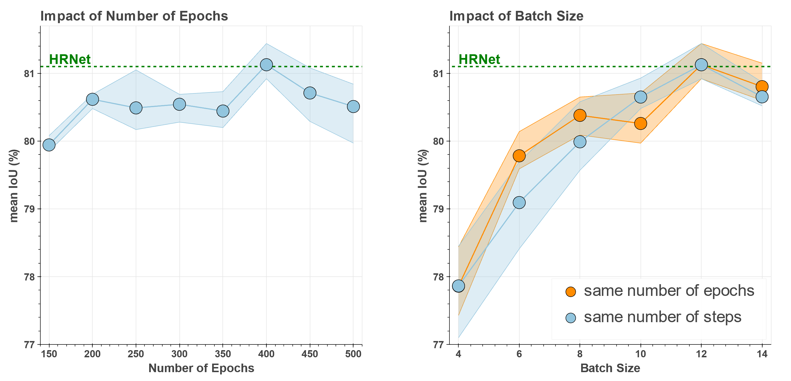
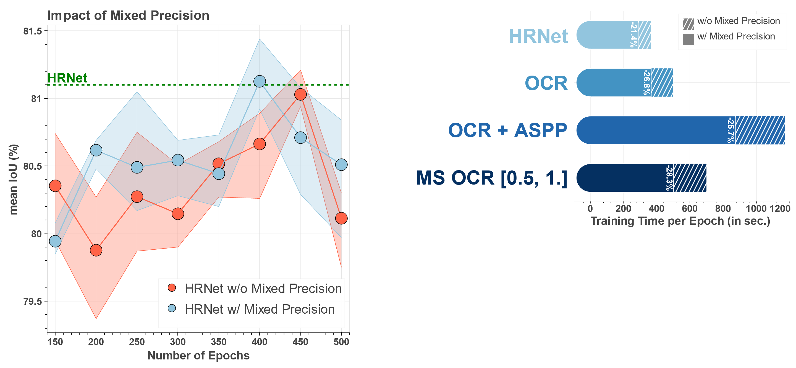
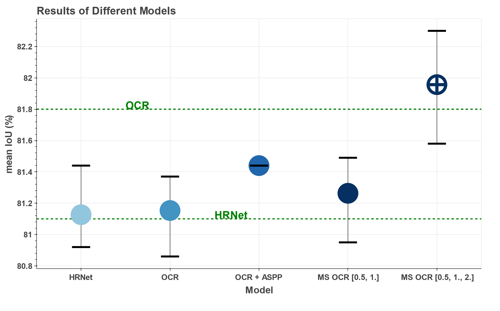
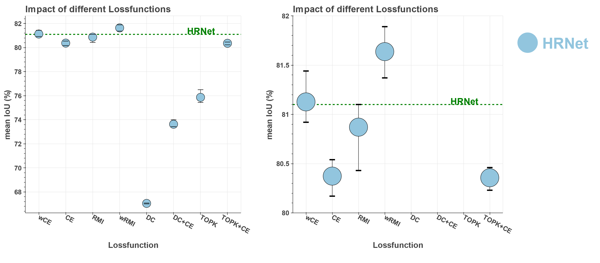
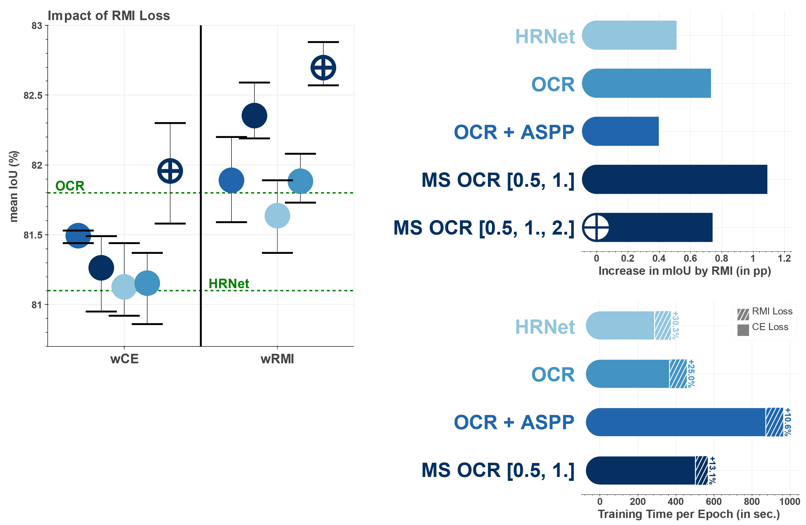
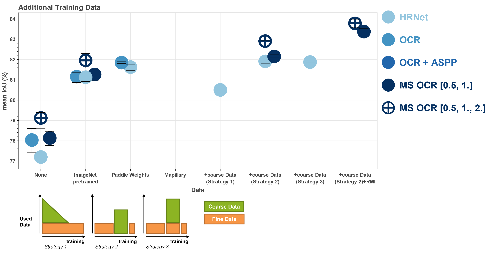
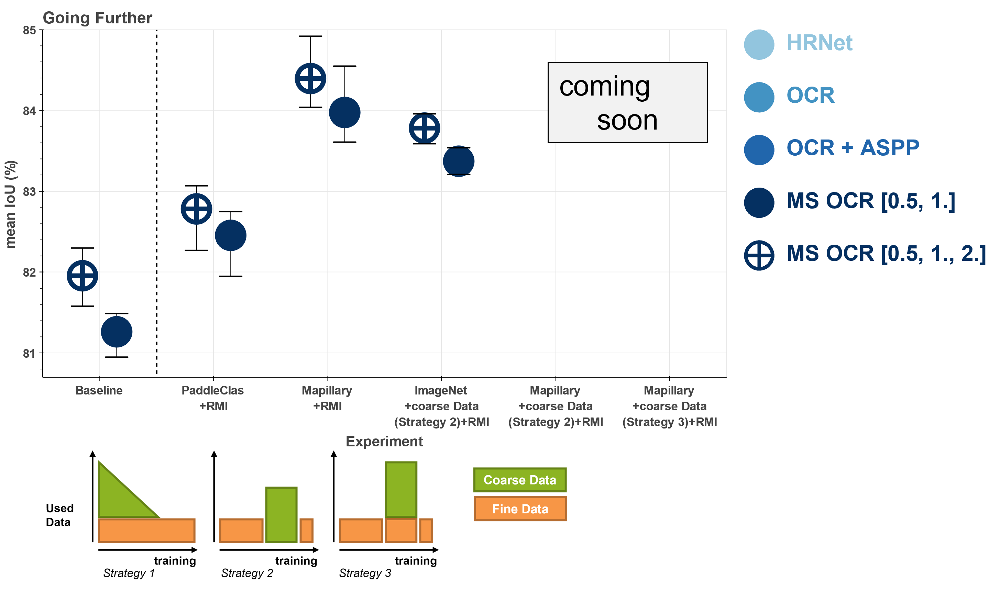
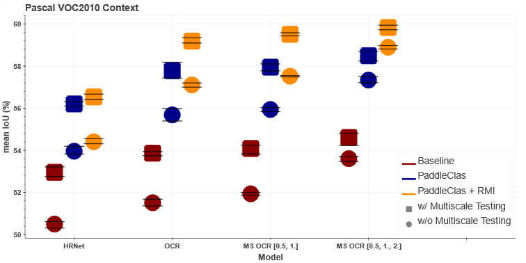

<div align="center">

# Semantic Segmentation Framework using Pytorch Lightning

  <a href="https://www.python.org/"></a>
  <a href="https://pytorch.org/get-started/locally/"></a>
  <a href="https://pytorchlightning.ai/"></a>
  <a href="https://albumentations.ai/"></a>
  <a href="https://hydra.cc/"></a>
</div>

This repository contains an easy-to-use and flexibly customizable framework for training semantic segmentation models.
This provides the ability to compare different state-of-the-art (SOTA) segmentation models under same conditions on different datasets.
Several architectures like [High-Resolution Network (HRNet)](https://arxiv.org/pdf/1904.04514.pdf), [Object Contextual Representation (OCR)](https://arxiv.org/pdf/1909.11065.pdf) and [Hierarchical Multi-Scale Attention (MS OCR)](https://arxiv.org/pdf/2005.10821.pdf) are already supported, 
as well as relevant datasets like [Cityscapes](https://www.cityscapes-dataset.com/) (coarse and fine) and [PASCAL VOC2010 Context](https://cs.stanford.edu/~roozbeh/pascal-context/) (59 and 60 classes).
Additionally, features like [Region Mutual Information (RMI)](https://arxiv.org/pdf/1910.12037.pdf) loss, mixed precision or multi-GPU training are provided among others.
This repository uses new and upcoming packages such as Pytorch Lightning and Hydra, and is designed to be extended with additional models and datasets, as well as other optimizers, schedulers, metrics, loss functions, and data augmentations.

The following contains information about how to [set up the data](#setting-up-the-data) and [run the code](#running-code).
A comparison between different SOTA approaches (HRNet, OCR,OCR+ASPP, MS OCR) on the Cityscapes and PASCAL VOC Context datasets is shown in the [experiments](#experiments) section.
For an advanced use of this framework, the [***config/* folder**](/config#walkthrough-the-config-jungle) contains a full explanation of all available configurations and how to customize the code to your needs.

### Overview

**Cityscapes**

Overview about the results on the **Cityscapes val** set. 
The best result from three runs (mean intersection over union, mIoU) is reported.
A more detailed analysis is given in the [experiments](#cityscapes-1) section.

| Model                | Baseline | RMI loss | Paddle weights | Mapillary pretrained | using Coarse Data | Mapillary + Coarse Data + RMI |
|----------------------|:--------:|:--------:|:--------------:|:--------------------:|:-----------------:|:-----------------:|
| HRNET                | 81.44    |  81.89   |     81.74      |      **83.02**       |       82.03       |         -         |
| OCR                  | 81.37    |  82.08   |     81.89      |        **83.37**         |       82.24       |         -         |
| OCR + ASPP           | 81.53    |  **82.20**   |       -        |          -           |         -         |         -         |
| MS OCR [0.5, 1.]     | 81.49    |  82.59   |     82.18      |        83.63         |       82.26       |       **84.80**       |
| MS OCR [0.5, 1., 2.] | 82.30    |  82.88   |     82.79      |        84.31         |       82.95       |       **85.31**       |

**Pascal VOC**

Overview of the results on the **PASCAL VOC2010 Context** set. 
The best result from three runs (mean intersection over union, mIoU) is reported.
A more detailed analysis is given in the [experiments](#pascal-voc2010-context) section.
Models are tested with and without multiscale testing.

| Model | Baseline | PaddleClass |PaddleClass + RMI | Baseline * | PaddleClass * |PaddleClass + RMI * |
|:-----:|:--------:|:-----------:|:--------------:|:--------:|:-----------:|:--------------:|
| HRNet              | 50.61 | 54.19 | 54.55 | 53.21 | 56.31 | 56.67 |
| OCR                | 51.68 | 55.98 | 57.20 | 53.94 | 58.18 | 59.34 |
| MS OCR [0.5, 1]    | 52.00 | 56.03 | 57.54 | 54.24 | 58.10 | 59.58 |
| MS OCR [0.5, 1, 2] | 53.71 | 57.50 | 58.97 | 54.81 | 58.68 | 59.94 |

**Multi Scale Testing with Scales [0.5, 0.75, 1., 1.25, 1.5, 1.75, 2.] and flipping*

### References
This repository adopts code from the following sources:
- **HRNet** ( High-Resolution Representations for Semantic Segmentation, [paper](https://arxiv.org/pdf/1904.04514.pdf), [source code](https://github.com/HRNet/HRNet-Semantic-Segmentation))
- **OCR** (Object Contextual Representation, [paper](https://arxiv.org/pdf/1909.11065.pdf), [source code](https://github.com/HRNet/HRNet-Semantic-Segmentation))
- **OCR + ASPP** (Combines OCR with an ASPP module, [source code](https://github.com/NVIDIA/semantic-segmentation/tree/main/network))
- **MS OCR** (Hierarchical Multi-Scale Attention for Semantic Segmentation, [paper](https://arxiv.org/pdf/2005.10821.pdf), [source code](https://github.com/NVIDIA/semantic-segmentation/tree/main/network))
- **RMI** (Region Mutual Information Loss for Semantic Segmentation, [paper](https://arxiv.org/pdf/1910.12037.pdf), [source code](https://github.com/ZJULearning/RMI))
- **DC+CE** (combination from Dice and Cross Entropy Loss), **TOPK**, **TOPK+DC** are all from nnUNet ([paper](https://www.nature.com/articles/s41592-020-01008-z), [source code](https://github.com/MIC-DKFZ/nnUNet))
# How To Run

## Requirements

Install the needed packages by the following command. You might need to adapt the cuda versions for torch and torchvision specified in *requirements.txt*.
Find a pytorch installation guide for your system [here](https://pytorch.org/get-started/locally/#start-locally).
````shell
pip install -r requirements.txt
````
To check if everything is working you can run a "unit test" using Pytorch Lightnings [fast_dev_run](https://pytorch-lightning.readthedocs.io/en/stable/common/debugging.html#fast-dev-run) by:
``
python main.py +pl_trainer.fast_dev_run=True
``

Among others, this repository is mainly built on the following packages.
You may want to familiarize yourself with their basic use beforehand.

- **[Pytorch](https://pytorch.org/)**: The machine learning/deep learning library used in this repository.
- **[Pytorch Lightning](https://www.pytorchlightning.ai/):** 
An open source framework for organizing Pytorch code and supporting machine learning development.
It is automating most of the training loop and offers many useful features like mixed precision training.
Lightning also makes code scalable to any hardware(CPU, GPU, TPU) without changing the code, as well as distributed training on multiple GPUs.
- **[Hydra](https://hydra.cc/docs/intro/):** Framework to simplify the development, organization, and configuration of machine learning experiments.
It provides the ability to dynamically create a hierarchical configuration by composition and override it through config files and the command line.
- **[Albumentations](https://albumentations.ai):** Package for fast and flexible data augmentation in Semantic Segmentation (Albumentations is not limited to segmentation, but only that is used in this repository). 
Albumentations provides a lot of augmentations that can be used. Also random operations (e.g. random cropping) can be applied directly to images and masks.

## Setting up the Data

Currently, the following datasets are supported: Cityscapes Dataset(fine and coarse) and Pascal Context Dataset(59 and 60 classes).
Follow the instructions below to set up the respective datasets.
Moreover, the [customization section](/config#dataset) gives advice on adding further datasets.

### Cityscapes
<details><summary>Click to expand/collapse</summary>
<p>

Download the Cityscapes dataset from [here](https://www.cityscapes-dataset.com/downloads/). 
You have to create an account and afterward download: *leftImg8bit_trainvaltest.zip* (11GB)  and *gtFine_trainvaltest.zip* (241MB).
Unzip them and put them into a folder, the structure of the folder should now look like this:
````
cityscapes
    ├── leftImg8bit_trainvaltest
    │   └── leftImg8bit
    │       ├── train
    │       │   ├── aachen
    │       │   └── ...  
    │       └── val
    │           ├── frankfurt
    │           └── ...  
    └── gtFine_trainvaltest
        └── gtFine
            ├── test
            │   └── ...
            ├── train
            │   └── ...        
            └── val
                └── ...

````
The cityscapes dataset contains 34 classes by default but only 19 of them are used in practices.
To avoid doing this conversion at each training step, it is done in a preprocessing step.
To do this preprocessing run the following code with adjusting the data_path to the location which contains the *leftImg8bit_trainvaltest* and *gtFine_trainvaltest* folders. 
This will create a new mask for each data sample with the converted class labeling which will be merged into the folder/data structure of the cityscapes dataset.
````
python datasets/Cityscapes/process_Cityscapes.py home/.../Datasets/cityscapes
````
After downloading and setting up the data, the last step is to adjust the path in the configuration.
Open the file of the environment you are using (by default *config/environment/local.yaml*) and adopt the cityscapes path to the location of the folder where your *gtFine_trainvaltest* and *leftImg8bit_trainvaltest* are.
For this example this would look like this:
````yaml
config/environment/local.yaml
─────────────────────────────
...
paths:
  cityscapes: /home/.../Datasets/cityscapes
````
</p>
</details>

### Cityscapes_Coarse
<details><summary>Click to expand/collapse</summary>
<p>

The cityscapes dataset provides 20k additional coarse labeled images.
Since  cityscapes_coarse contains no validation data the fine annotated validation set is used for this purpose.
This is an extension to cityscapes rather than a separate dataset, so [cityscapes](#cityscapes) should be set up first. 
Afterwards download the cityscapes_coarse dataset from [here](https://www.cityscapes-dataset.com/downloads/) (*leftImg8bit_trainextra.zip (44GB)* and *gtCoarse.zip (1.3GB)*) and unzip them in the same folder as your cityscapes data.
You then should end up with this:
````
cityscapes
    ├── leftImg8bit_trainvaltest
    │   └── leftImg8bit
    │       └── ...
    ├── gtFine_trainvaltest
    │   └── gtFine
    │       └── ...
    ├── leftImg8bit_trainextra
    │   └── leftImg8bit
    │       └── ...
    └── gtCoarse
        └── gtCoarse
            └── ...
````
Afterwards process the cityscapes_coarse dataset in the same way as it was done for cityscapes by:
````shell
python datasets/Cityscapes/process_Cityscapes_coarse.py home/.../Datasets/cityscapes
````

</p>
</details>

### PASCAL Context
<details><summary>Click to expand/collapse</summary>
<p>

Click [here](https://cs.stanford.edu/~roozbeh/pascal-context/trainval.tar.gz) for directly downloading the labels or do it manually by downloading the file *trainval.tar.gz (30.7 MB file)* from [PASCAL-Context](https://cs.stanford.edu/~roozbeh/pascal-context/#download). 
Click [here](http://host.robots.ox.ac.uk/pascal/VOC/voc2010/VOCtrainval_03-May-2010.tar) for directly downloading the images or do it manually by downloading the file *training/validation data (1.3GB tar file)* from [PASCAL VOC](http://host.robots.ox.ac.uk/pascal/VOC/voc2010/index.html#devkit).
Unzip both files and put them into a folder. 
The structure of you folders should look like this:

````
Datasets
    ├── VOCtrainval_03-May-2010/VOCdevkit/VOC2010
    │   ├── Annotations
    │   ├── ImageSets
    │   └── ...
    └── trainval
        └──trainval
            ├── *.mat
            └── ...
````
Since the VOC2010 dataset contains a lot of unnecessary stuff (unnecessary for this repo), only the required data is extracted and merged with the transformed label data from *trainval/*.
Run the following script which creates a new folder structure with only the relevant and transformed data.
````shell
python datasets/VOC2010_Context/process_VOC2010_Context.py home/.../Datasets/
````
Afterwards a new dataset is created and the data from *trainval* and *VOCtrainval_03-May-2010*  is not further needed.
The new dataset looks like this:
````
Datasets
    └── VOC2010_Context
        ├── Annotations
        │   ├── train
        │   └── val
        └── Images
            ├── train
            └── val
````
After downloading and setting up the data, the last step is to adjust the path in the configuration.
Open the file of the environment you are using (by default *config/environment/local.yaml*) and adopt the VOC2010_Context path to the location of the folder where your *Images* and *Annotations* are.
For this example this would look like this:
````yaml
config/environment/local.yaml
─────────────────────────────
...
paths:
    VOC2010_Context: /home/.../Datasets/VOC2010_Context
````

</p>
</details>

## Download Pretrained Weights

Pretrained weights for HRNet can be found [here](https://github.com/HRNet/HRNet-Image-Classification#imagenet-pretrained-models).
Pretrained weights on ImageNet and PadddleClas are available.
Since all models (HRNet, OCR, OCR+ASPP, MS OCR) are using a HRNet backbone, these weights can be used for all of them.
For MS OCR pretrained weights on Mapillary are available [here](https://github.com/NVIDIA/semantic-segmentation#download-weights).
These Mapillary weights can be also be used for the other models.
Download the preferred weights (direct download links below) and put them in the *pretrained/* folder.
- ImageNet weights: [download](https://1drv.ms/u/s!Aus8VCZ_C_33dKvqI6pBZlifgJk)
- PaddleClas weights: [download](https://github.com/HRNet/HRNet-Image-Classification/releases/download/PretrainedWeights/HRNet_W18_C_ssld_pretrained.pth)
- Mapillary weights: [download](https://drive.google.com/file/d/1Whz--rurtBoIsfF-t3YB9NEt3GT6hBQI/view?usp=sharing)

## Running Code

The following is a **Quickstart** guide on how to run the code. 
To adopt the configuration you can edit the */config/baseline.yaml* file directly or use the hydra commandline syntax. 
As you will see, the basic syntax of how to run and adopt the code is simple.
The crucial part is to know which parameters you can configure and how.
Therefore, the [*config/* folder](/config) explains in detail how the configuration is composed and which parameters it contains.
There is also an explanation on how to add your own models/datasets etc.
Some examples on how to execute code are given below in the [experiment](#experiments) section.


### Baseline
After setting up the data and downloading the pretrained weights, you can directly run the baseline by:
````shell
python main.py
````
This trains HRNet on the Cityscape Dataset with the following default settings: 
Stochastic Gradient Descent(SGD) with weight decay of 0.0005 and a momentum of 0.9 as optimizer.
The initial learning rate is set to 0.01 and a polynomial learning rate scheduler with exponent of 0.9 is used.
It is trained for 400 epochs and a batch size of 6 per GPU.
Cross Entropy Loss is used as well as Mixed Precision and Synchronized Batch Normalization (for multiple GPUS).
By default ImageNet pretrained weights are used for each model.

### Selecting a Model

You can change the model by adopting the corresponding entry in */config/baseline.yaml* or from the commandline by:
````shell
python main.py model=hrnet                      # High-Resolution Representations for Semantic Segmentation
python main.py model=hrnet_ocr                  # Object Contextual Representation
python main.py model=hrnet_ocr_aspp             # Combination of OCR with an ASPP module
python main.py model=hrnet_ocr_ms               # Hierarchical Multi-Scale Attention for Semantic Segmentation
````
#### Selecting Pretrained weights

````shell
python main.py MODEL.PRETRAINED=False           # Trained from scratch without Pretraining
python main.py MODEL.pretrained_on=ImageNet     # Pretrained on ImageNet
python main.py MODEL.pretrained_on=Paddle       # Pretrained using PaddleClas weights
python main.py MODEL.pretrained_on=Mapillary    # Pretrained on Mapillary Dataset
````

### Selecting a Dataset
In the same way the dataset can be changed by:
````shell
python main.py dataset=Cityscapes               # Cityscapes Dataset with 19 classes using fine annotated data
python main.py dataset=Cityscapes_coarse        # Cityscapes Dataset with 19 classes using coarse annotated data
python main.py dataset=Cityscapes_fine_coarse   # Cityscapes Dataset with 19 classes using fine and coarse annotated data
python main.py dataset=VOC2010_Context          # VOC2010_Context Dataset with 59 classes setting
python main.py dataset=VOC2010_Context_60       # VOC2010_Context Dataset with 60 classes setting
````
### Changing Hyperparmeters
The basic hyperparameters needed for training can be set as shown below (in the example below the default values are shown):
````shell
python main.py epochs=400 batch_size=6 val_batch_size=6 num_workers=10 lr=0.001 wd=0.0005 momentum=0.9
````
#### Changing Loss Function(s)
For each model output a separate loss function can be set/has to be set. 
For a single output the loss function can be changed by ``lossfunction=RMI``.
If the model has multiple outputs, pass a list of loss functions ``lossfunction=[RMI,CE,CE,CE]``, with one entry for each model output.
The ``lossweight`` argument can be used analogues to weight the model outputs differently.
The provided models have the following number of outputs: model(num_putputs), hrnet(1), hrnet_ocr(2), hrnet_ocr_aspp(2), hrnet_ocr_ms(4).

````shell
python main.py lossfunction=CE                  # default Cross Entropy loss
python main.py lossfunction=wCE                 # including weights into Cross Entropy
python main.py lossfunction=RMI                 # using Region Mutual Information(RMI) Loss
python main.py lossfunction=wRMI                # using weighted RMI Loss
python main.py lossfunction=[wRMI,wCE]          # can be arbitrarily combined for multiple outputs
python main.py lossfunction=[CE,CE,CE,CE] lossweight=[1.0,0.4,0.05,0.05]    # default settings
````
### Logging

The logging structure of the code is depicted below.
The ``LOGDIR=<some.folder.dir>`` argument defines the logging folder (*"logs/"* by default).
Checkpointing can be disabled/enabled by ``pl_trainer.enable_checkpointing= <True or False>``.
To resume or finetune from a checkpoint use the finetune_from argument(`` python main.py +finetune_from=<path.to.ckpt>``).
For a better overview, experiments can also be named by ``experiment="my_experiment"`` ("baseline" by default).

````
LOGDIR                                      # logs/ by default
    └── Dataset                             # Name of the used Dataset
        └──Model                            # Name of the used Model
           └──experiment_overrides          # Parameters that have been overwritten and differ from the baseline
              └──Date                       # Date as unique identifier
                  ├── checkpoints/          # if checkpointing is enabled this contains the best and the last epochs checkpoint
                  ├── hydra/                # contains hydra files
                  ├── validation/           # optional (only when model is validated) - contains testing results
                  ├── ConfusionMatrix.pt    # Confusion Matrix of best epoch, for the case that other metrics are needed later
                  ├── event.out...          # Tensorboard log
                  ├── main.log              # logging
                  └── hparams.yaml          # resolved config
````

### Run Validation/Testing
Some models and datasets need validation/testing under different conditions than during training(e.g. additional scale for MS OCR, or multiscale testing for VOC2010_Context).
Therefore, the following command must be executed beforehand.
Consider that checkpointing hast to be enabled when training (``python main.py .... pl_trainer.enable_checkpointing=True`` or set to True in 'baseline.yaml') to validate/test afterwards.
MS OCR and VOC2010_Context use a predefined validation setting. However, this setting can be changed [here](/config#testing).
````shell
python validation.py --valdir=<path.to.the.outputdir.of.training>
# eg python validation.py --valdir="/../Semantic_Segmentation/logs/VOC2010_Context/hrnet/baseline__/2022-02-15_13-51-42"
````

# Experiments

## Cityscapes

The following experiments were performed under the following training settings and the reported results are for the Cityscapes validation set.
*Stochastic Gradient Descent(SGD)* with *momentum = 0.9* and *weight decay = 0.0005* is used for optimization. 
The models are trained with an initial learning rate of 0.01 and a polynomial learning rate scheduler.
These settings have established themselves as a standard setting for cityscapes and are therefore also used here.
Additionally, the batch size is set to 12 and the number of epochs to 400 (see [Defining the Baseline](#defining_the_baseline)).
For data augmentation the images are randomly scaled to a range of [0.5, 2] and randomly cropped to a size of 1024x512 afterwards.
Besides that, only random flipping and normalization is performed.
By default the models are initialized using pretrained weights on ImageNet.
Unless specified, training is performed on 2 GPUs (with a batch size of 6 per GPU) and each experiment was repeated 3 times.
The *MS OCR* model is trained with two scales (*[0.5, 1.]*) during training and for inference a third (*[0.5, 1., 2.]*) is added.
Typically, both settings are evaluated in the following experiments.

### Time Complexity

The following figure shows the training and inference time of each model, as well as the number of parameters.
It can be seen that the number of parameters is in a similar range for all models, but still as the number of parameters increases, the time complexity of the models also increases.
Thereby OCR-ASPP has by far the highest training time.
Using an additional scale to MS OCR highly increases the inference time of the model. 
That's why MS OCR [0.5, 1.] is used for training and only for inference MS OCR [0.5, 1., 2.] is used (that's why both have the same training time)
The runtime measurements are done using a single GPU (NVIDIA GeForce RTX 3090). 
To fit on a single GPU, the batch_size is reduced compared to the baseline.


### Defining the Baseline

#### Number of Epochs and Batch Size

Looking at further hyperparameters, it can be seen that the batch size in particular is critical.
For good results a large batch size is mandatory, so a GPU with sufficient memory or multiple GPUs with synchronized batch normalization should be used.
If these hardware requirements cannot be fulfilled, [accumulate gradient batches](https://pytorch-lightning.readthedocs.io/en/stable/advanced/training_tricks.html#accumulate-gradients) can be used instead.
This will not have exactly the same effect but will still help to increase the effective batch size.
With the number of epochs, the fluctuation is much smaller, but a suitable value is still important.
In green, the HRNet results reported in the corresponding paper are shown for comparison.
Resulting from the experiments, a batch size of 12 and 400 epochs are used for further experiments.



<details><summary>Scripts</summary>
<p>

Running HRNet for different number of epochs
````shell

python main.py epochs=150
python main.py epochs=200
python main.py epochs=250
python main.py epochs=300
python main.py epochs=350
python main.py epochs=400
python main.py epochs=450
python main.py epochs=500
````
Running HRNet with different batch sizes (on a single GPU)
````shell
#for the same number of epochs
python main.py batch_size=4 epochs=400
python main.py batch_size=6 epochs=400
python main.py batch_size=8 epochs=400
python main.py batch_size=10 epochs=400
python main.py batch_size=12 epochs=400
python main.py batch_size=14 epochs=400
````
````shell
#for the same number of steps
python main.py batch_size=4 epochs=134
python main.py batch_size=6 epochs=201
python main.py batch_size=8 epochs=268
python main.py batch_size=10 epochs=334
python main.py batch_size=12 epochs=400
python main.py batch_size=14 epochs=468
````

</p>
</details>

#### Mixed Precision 

The use of [Mixed Precision](https://pytorch-lightning.readthedocs.io/en/latest/advanced/mixed_precision.html#mixed-precision) reduces the training time of the models by 20% to 30%.
In addition, Mixed Precision was able to improve the results in these experiments.
Since Mixed Precision drastically reduces the training time, Mixed Precision is used as default for further experiments.



<details><summary>Scripts</summary>
<p>

Training with Mixed Precision
````shell
python main.py epochs=150
python main.py epochs=200
python main.py epochs=250
python main.py epochs=300
python main.py epochs=350
python main.py epochs=400
python main.py epochs=450
python main.py epochs=500
````
Training without Mixed Precision
````shell
python main.py pl_trainer.precision=32 epochs=150
python main.py pl_trainer.precision=32 epochs=200
python main.py pl_trainer.precision=32 epochs=250
python main.py pl_trainer.precision=32 epochs=300
python main.py pl_trainer.precision=32 epochs=350
python main.py pl_trainer.precision=32 epochs=400
python main.py pl_trainer.precision=32 epochs=450
python main.py pl_trainer.precision=32 epochs=500
````

</p>
</details>


### Different Models

After defining the baseline on HRNet, other models are also trained and validated under same conditions.
As can be seen, OCR gives quite similar results to HRNet in these experiments. 
What is also noticeable, in contrast to HRNet, the results documented in the paper cannot be achieved with OCR
(it must be said that the baseline used in the OCR paper is slightly different from the one used here).
The use of an additional ASPP module leads to a slight improvement in the OCR results, but significantly increases the time complexity of the model.
Using MS OCR with two scales gives similar results to the other networks, but adding a third scale gives by far the best results.



<details><summary>Appendix</summary>
<p>

|         Model          | Experiment | mean mIoU |    mIoU per Run     |
|:----------------------:|:----------:|:---------:|:-------------------:|
|         HRNet          |  Baseline  |   81.13   | 81.02, **81.44**, 80.92 |
|          OCR           |  Baseline  |   81.15   | **81.37**, 81.23, 80.86 |
|       OCR + ASPP       |  Baseline  |   81.49   | 81.44, 81.51, **81.53** |
|    MS OCR [0.5, 1.]    |  Baseline  |   81.26   | 80.95, 81.35, **81.49** |
|  MS OCR [0.5, 1., 2.]  |  Baseline  |   81.96   | 81.58, 81.99, **82.3**  |


</p>
</details>

<details><summary>Scripts</summary>
<p>

Training the different Models
````shell
python main.py model=hrnet
python main.py model=hrnet_ocr
python main.py model=hrnet_ocr_aspp
python main.py model=hrnet_ocr_ms
````

</p>
</details>


### Different Loss Functions 

Looking at the different loss functions, it can be seen that the best results can be achieved with Cross-Entropy (CE) and Region Mutual Information (RMI) Loss.
By contrast, Dice Loss based functions perform considerably worse in terms of mIOU. 
With changes to the learning rate and number of epochs, these can be tuned somewhat, but are still significantly worse.
It can also be seen that the use of weights (wCE and wRMI) compensate the class imbalances in Cityscapes and significantly improve the results.
Only HRNet is used for these experiments.



<details><summary>Appendix</summary>
<p>

| Model | Experiment | mean mIoU |      mIoU per Run       |
|:-----:|:----------:|:---------:|:-----------------------:|
| HRNet |     CE     |   80.37   | **80.54**, 80.41, 80.17 |
| HRNet |    wCE     |   81.13   | 81.02, **81.44**, 80.92 |
| HRNet |    RMI     |   80.87   | **81.1**, 80.43, 81.08  |
| HRNet |    wRMI    |   81.63   | **81.89**, 81.37, 81.65 |
| HRNet |     DC     |     -     |            -            |
| HRNet |   DC+CE    |   73.63   | **74.0**, 73.46, 73.43  |
| HRNet |    TOPK    |   75.86   | 75.44, 75.65, **76.5**  |
| HRNet |  TOPK+DC   |   80.36   | 80.38, **80.46**, 80.23 |


</p>
</details>

<details><summary>Scripts</summary>
<p>

Training HRNet with different loss functions
````shell
python main.py lossfunction=CE
python main.py lossfunction=wCE
python main.py lossfunction=RMI
python main.py lossfunction=wRMI
python main.py lossfunction=DC
python main.py lossfunction=DC_CE
python main.py lossfunction=TOPK
python main.py lossfunction=DC_TOPK
````

</p>
</details>

### Closer look at RMI loss 

As seen in the previous experiments, using the RMI loss gives the best results, so this is tested with the other models as well.
RMI loss results in significantly increased mIoU (compared to CE) for all models.
However, it also leads to an increased runtime.
To keep this increase as low as possible, RMI loss is only used during training and CE loss is still used during validation (validation loss).



<details><summary>Appendix</summary>
<p>

|        Model         | Experiment | mean mIoU |      mIoU per Run       |
|:--------------------:|:----------:|:---------:|:-----------------------:|
|        HRNet         |    wCE     |   81.13   | 81.02, **81.44**, 80.92 |
|        HRNet         |    wRMI    |   81.64   | **81.89**, 81.37, 81.65 |
|         OCR          |    wCE     |   81.15   | **81.37**, 81.23, 80.86 |
|         OCR          |    wRMI    |   81.88   | 81.84, **82.08**, 81.73 |
|      OCR + ASPP      |    wCE     |   81.49   | 81.44, 81.51, **81.53** |
|      OCR + ASPP      |    wRMI    |   81.89   | 81.59, **82.20**, 81.88 |
|   MS OCR [0.5, 1.]   |    wCE     |   81.26   | 80.95, **81.35**, 81.49 |
|   MS OCR [0.5, 1.]   |    wRMI    |   82.35   | 82.19, 82.28, **82.59** |
| MS OCR [0.5, 1., 2.] |    wCE     |   81.96   | 81.58, 81.99, **82.30** |
| MS OCR [0.5, 1., 2.] |    wRMI    |   82.70   | 82.57, **82.88**, 82.64 |

</p>
</details>

<details><summary>Scripts</summary>
<p>

````shell
#Running HRNet with CE and RMI loss
python main.py lossfunction=wCE
python main.py lossfunction=wRMI
#Running OCR with CE and RMI loss
python main.py model=hrnet_ocr lossfunction=[wCE,wCE]
python main.py model=hrnet_ocr lossfunction=[wRMI,wCE]
#Running OCR + ASPP with CE and RMI loss
python main.py model=hrnet_ocr_aspp lossfunction=[wCE,wCE]
python main.py model=hrnet_ocr_aspp lossfunction=[wRMI,wCE]
#Running MS OCR with CE and RMI loss
python main.py model=hrnet_ocr_ms lossfunction=[wCE,wCE,wCE,wCE]
python main.py model=hrnet_ocr_ms lossfunction=[wRMI,wCE,wCE,wCE]
````

</p>
</details>

### Available Data

Since the previous experiments focused on model and training parameters, a closer look at the used data is given here.
For the baseline so far ImageNet pretrained weights are used.
Comparison of the results with models without additional data (trained from scratch) show that the use of pretrained weights has a large impact in these experiments.
The use of PaddleClas weights can further enhance results, and the best results can be achieved by pretraining on Mapillary.
The reason for this is the similarity of Mapillary to Cityscapes (both urban setting).
Besides this, the use of the coarse cityscapes data can also improve the results.
Three different strategies on how to integrate the additional data are tested.
The best result is achieved with strategy 2 when the model is first trained on fine annotated data, afterwards the model is finetuned (with reduced lr) with only the coarse annotated data and finally the model is finetuned again (with reduced lr) on the fine annotated data.
The experiments show that there are strong differences in the results, depending on which data is used.



<details><summary>Appendix</summary>
<p>

|        Model         |  Experiment  | mean mIoU |      mIoU per Run       |
|:--------------------:|:------------:|:---------:|:-----------------------:|
|        HRNet         | From Scratch |   77.19   | **76.99**, 77.64, 76.95 |
|        HRNet         |   ImageNet   |   81.13   | 81.02, **81.44**, 80.92 |
|        HRNet         | PaddleClas  |   81.63   | **81.74**, 81.69, 81.45 |
|        HRNet         |  Mapillary   |   82.74   | 82.80, 82.41, **83.02** |
|        HRNet         | Coarse Data  |   81.91   | **82.03**, 81.79, 81.91 |
|         OCR          | From Scratch |   78.03   | **78.60**, 77.43, 78.06 |
|         OCR          |   ImageNet   |   81.15   | **81.37**, 81.23, 80.86 |
|         OCR          | PaddleClas  |   81.85   | 81.80, 81.85, **81.89** |
|         OCR          |  Mapillary   |   83.20   | 82.87, **83.37**, 83.36 |
|         OCR          | Coarse Data  |   82.09   | 82.16, **82.24**, 81.86 |
|   MS OCR [0.5, 1.]   | From Scratch |   78.13   | 77.76, 78.17, **78.46** |
|   MS OCR [0.5, 1.]   |   ImageNet   |   81.26   | 80.95, 81.35, **81.49** |
|   MS OCR [0.5, 1.]   | PaddleClas  |   81.94   | **82.18**, 82.09, 81.55 |
|   MS OCR [0.5, 1.]   |  Mapillary   |   83.44   | 83.52, **83.63**, 83.18 |
|   MS OCR [0.5, 1.]   | Coarse Data  |   82.15   | 82.08, **82.26**, 82.11 |
| MS OCR [0.5, 1., 2.] | From Scratch |   79.12   | 78.59, 79.38, **79.39** |
| MS OCR [0.5, 1., 2.] |   ImageNet   |   81.96   | 81.58, 81.99, **82.30** |
| MS OCR [0.5, 1., 2.] | PaddleClas  |   82.58   | **82.79**, 82.71, 82.23 |
| MS OCR [0.5, 1., 2.] |  Mapillary   |   84.06   | **84.31**, 84.15, 83.73 |
| MS OCR [0.5, 1., 2.] | Coarse Data  |   82.91   | 82.91, **82.95**, 82.86 |

</p>
</details>


<details><summary>Scripts</summary>
<p>

Training Models with and without different pretrained weights
````shell
#Training from Scratch
python main.py model=hrnet MODEL.PRETRAINED=False
python main.py model=hrnet_ocr MODEL.PRETRAINED=False
python main.py model=hrnet_ocr_aspp MODEL.PRETRAINED=False
python main.py model=hrnet_ocr_ms MODEL.PRETRAINED=False
#Pretrained on ImageNet
python main.py model=hrnet MODEL.pretrained_on=ImageNet
python main.py model=hrnet_ocr MODEL.pretrained_on=ImageNet
python main.py model=hrnet_ocr_aspp MODEL.pretrained_on=ImageNet
python main.py model=hrnet_ocr_ms MODEL.pretrained_on=ImageNet
#Pretrained with PaddleClas
python main.py model=hrnet MODEL.pretrained_on=Paddle
python main.py model=hrnet_ocr MODEL.pretrained_on=Paddle
python main.py model=hrnet_ocr_aspp MODEL.pretrained_on=Paddle
python main.py model=hrnet_ocr_ms MODEL.pretrained_on=Paddle
#Pretrained on Mapillary
python main.py model=hrnet MODEL.pretrained_on=Mapillary epochs=75
python main.py model=hrnet_ocr MODEL.pretrained_on=Mapillary epochs=75
python main.py model=hrnet_ocr_aspp MODEL.pretrained_on=Mapillary epochs=75
python main.py model=hrnet_ocr_ms MODEL.pretrained_on=Mapillary epoch=75
````
Training Models with coarse data
````shell
#HRNET
python main.py model=hrnet
python main.py model=hrnet epochs=25 lr=0.001 dataset=Cityscapes_coarse +finetune_from=<path.to.ckpt.of.previous.line>
python main.py model=hrnet epochs=65 lr=0.001 +finetune_from=<path.to.ckpt.of.previous.line>
#HRNET OCR
python main.py model=hrnet_ocr
python main.py model=hrnet_ocr epochs=25 lr=0.001 dataset=Cityscapes_coarse +finetune_from=<path.to.ckpt.of.previous.line>
python main.py model=hrnet_ocr epochs=65 lr=0.001 +finetune_from=<path.to.ckpt.of.previous.line>
#MS OCR
python main.py model=hrnet_ocr_ms 
python main.py model=hrnet_ocr_ms epochs=25 lr=0.001 dataset=Cityscapes_coarse +finetune_from=<path.to.ckpt.of.previous.line>
python main.py model=hrnet_ocr_ms epochs=65 lr=0.001 +finetune_from=<path.to.ckpt.of.previous.line>
````

</p>
</details>

### Going Further

The previous experiments have shown different methods to improve the results. These methods are combined in this section.
The experiments have shown that MS OCR provides the best results, which is why the focus is on this model.
First, the use of the additional data is combined with the RMI loss which leads to highly increased results.
The RMI loss was only used in the training blocks with the fine annotated data, because the experiments showed that the RMI loss does not work well with the coarse data.
Mapillary and PaddleClas pretraining gave better results than using ImageNet weight, so they will be tested in combination with RMI loss too.
Again, an increase in performance can be seen, with the best results for pretraining with Mapillary and RMI loss.
Finally, Mapillariy pretraining, RMI loss and the use of coarse annotated data are combined.
In the previous experiments, using strategy 2 to include coarse data produced the best results.
But for this, strategy 3 delivers better results, which are also the absolute highscores in these experiments.



<details><summary>Appendix</summary>
<p>


|        Model         |  Experiment  | mean mIoU |      mIoU per Run       |
|:--------------------:|:------------:|:---------:|:-----------------------:|
|   MS OCR [0.5, 1.]   | Baseline |   81.26   | 80.95, 81.35, **81.49** |
|   MS OCR [0.5, 1.]   |   Paddle + RMI   |   82.46   | **82.75**,82.67,81.95 |
|   MS OCR [0.5, 1.]   | Mapillary + RMI   | 83.98 | **84.55**, 83.61, 83.77 |
|   MS OCR [0.5, 1.]   | Coarse + RMI   | 83.37 | **83.54**, 83.37, 83.21 |
|   MS OCR [0.5, 1.]   |  Mapillary + RMI + Coarse   | 84.77 | **84.80**, 84.78, 84.73 |
| MS OCR [0.5, 1., 2.] | Baseline |   81.96   | 81.58, 81.99, **82.30** |
| MS OCR [0.5, 1., 2.] |   Paddle + RMI   |  82.78    | 83.01,**83.07**,82.27 |
| MS OCR [0.5, 1., 2.] | Mapillary + RMI  |   84.37  | **84.92**, 84.04, 84.23 |
|   MS OCR [0.5, 1., 2.]   |  Coarse + RMI   | 83.78 | **83.96**, 83.80, 83.59 |
| MS OCR [0.5, 1., 2.] |  Mapillary + RMI +Coarse   |    85.27 | **85.31**, 85.28, 85.22 |

</p>
</details>

<details><summary>Scripts</summary>
<p>

````shell
#Paddle + RMI
python main.py model=hrnet_ocr_ms lossfunction=[wRMI,wCE,wCE,wCE] MODEL.pretrained_on=Paddle
#Mapillary + RMI
python main.py model=hrnet_ocr_ms lossfunction=[wRMI,wCE,wCE,wCE] MODEL.pretrained_on=Mapillary epochs=75
#Mapillary + RMI + coarse Data (Strategy 2)
python main.py model=hrnet_ocr_ms epochs=75 lossfunction=[wRMI,wCE,wCE,wCE]
python main.py model=hrnet_ocr_ms epochs=25 lr=0.001 dataset=Cityscapes_coarse +finetune_from=<path.to.ckpt.of.previous.line>
python main.py model=hrnet_ocr_ms epochs=20 lr=0.001 lossfunction=[wRMI,wCE,wCE,wCE] +finetune_from=<path.to.ckpt.of.previous.line>
#Mapillary + RMI + coarse Data (Strategy 3)
python main.py model=hrnet_ocr_ms epochs=75 lossfunction=[wRMI,wCE,wCE,wCE]
python main.py model=hrnet_ocr_ms epochs=25 lr=0.001 dataset=Cityscapes_fine_coarse +finetune_from=<path.to.ckpt.of.previous.line>
python main.py model=hrnet_ocr_ms epochs=15 lr=0.001 lossfunction=[wRMI,wCE,wCE,wCE] +finetune_from=<path.to.ckpt.of.previous.line>
````
</p>
</details>

## Pascal VOC2010 Context

Some experiments are repeated using another dataset, which is the Pascal VOC2010 Context dataset.
This dataset contains natural images and no longer the urban setting as in cityscapes.
However, the focus is not on achieving the highest possible scores, but rather on verifying the results of the experiments on cityscapes.
Therefore the hyperparameters were taken from other experiments on PASCAL VOC2010 Context and only barely optimized.
*Stochastic Gradient Descent(SGD)* with *momentum = 0.9* and *weight decay = 0.0001* is used for optimization. 
The models are trained with an initial learning rate of 0.004 for HRNet and an initial learning rate of 0.001 for OCR and MS OCR.
A polynomial learning rate scheduler is used as well as a batch size of 16 and the model is trained for 200 epochs.
For data augmentation the images are resized and randomly scaled in the range *[0.5, 2]*, resulting in a size of *520x520* pixels after random cropping.
Besides that, only RGB-Shift, random flipping and normalization is performed. 
Similar as for the cityscapes experiments, the data augmentation is kept rather minimal.
By default the models are initialized using pretrained weights on ImageNet.
Unless specified, training is performed on 2 GPUs (with a batch size of 8 per GPU) and each experiment was repeated 3 times.
The *MS OCR* model is trained with two scales (*[0.5, 1.]*) during training and for inference a third (*[0.5, 1., 2.]*) is added.
Typically, both settings are evaluated in the following experiments.
Since SOTA approaches typically report their results on VOC2010 using multiscale testing, both validation with and without multiscale testing is reported here.
For multiscale Testing the scales [0.5, 0.75, 1., 1.25, 1.5, 1.75, 2.] and vertical flipping are used.

When looking at the results it can be seen that they are consistent to the previous ones on Cityscapes.
Starting with the models, the results are getting better by increasing the complexity, starting with HRNet then OCR and finally MS OCR.
Although it is worth noting that the difference between HRNet and OCR is more evident than for Cityscapes.
For MS OCR again using the additional scale increases the results for each experiment.
What is even more significant for VOC2010 than for Cityscapes, is the improvement through the PaddleClas weights.
Furthermore, the RMI loss again leads to an improved result.



<details><summary>Appendix</summary>
<p>

| Model | Experiment | mean mIoU |      mIoU per Run       |mean mIoU (MS) |      mIoU per Run (MS)      |
|:-----:|:----------:|:---------:|:-----------------------:|:---------:|:-----------------------:|
| HRNet | Baseline   |   50.50   | 50.61, 50.31, 50.57     |   52.95   | 53.21, 52.76, 52.89     |
| HRNet | PaddleClas |   53.96   | 53.85, 54.19, 53.83     |   56.20   | 56.19, 56.10, 56.31     |
| HRNet |    RMI     |   54.40   | 54.55, 54.35, 54.31     |   56.53   | 56.52, 56.41, 56.67     |
| OCR | Baseline   |   51.51   | 51.49, 51.36, 51.68 | 53.86 | 53.74, 53.91, 53.94     |
| OCR | PaddleClas |   55.68   | 55.67, 55.98, 55.39 | 57.78 | 57.72, 58.18, 57.43     |
| OCR |    RMI     |   57.10   | 57.11, 57.00, 57.20 | 59.18 | 59.34, 59.12, 59.09     |
| MS OCR [0.5, 1.]  | Baseline   |   51.93   | 52.00, 51.87, 51.93  |   54.09   | 53.83, 54.24, 54.19     |
| MS OCR [0.5, 1.]  | PaddleClas |   55.94   | 55.84, 55.94, 56.03  |   57.95   | 57.77, 58.10, 57.97    |
| MS OCR [0.5, 1.]  |    RMI     |   57.52   | 57.54, 57.53, 57.48  |   59.51   | 59.51, 59.43, 59.58    |
| MS OCR [0.5, 1., 2.]  | Baseline   |   53.60   | 53.47, 53.63, 53.71     |   54.61   | 54.79, 54.23, 54.81     |
| MS OCR [0.5, 1., 2.]  | PaddleClas |   57.33   | 57.50, 57.21, 57.29     |   58.49   | 58.68, 58.24, 58.54     |
| MS OCR [0.5, 1., 2.]  |    RMI     |   58.89   | 58.81, 58.89, 58.97     |   59.83   | 59.72, 59.94, 59.82     |

</p>
</details>

<details><summary>Scripts</summary>
<p>

How to train and validate the models correctly. Consider disabling cuda benchmark for (multi-scale) testing by ``pl_trainer.benchmark=False``.
````shell
#HRNet
python main.py model=hrnet dataset=VOC2010                                                               # Baseline
python main.py model=hrnet dataset=VOC2010 MODEL.pretrained_on=Paddle                                    # using PaddleClas weights
python main.py model=hrnet dataset=VOC2010 MODEL.pretrained_on=Paddle lossfunction=RMI                   # using PaddleClas + RMI
### Since some pseudo validation is used for runtime reduction during training, the models have to be validated seperatly ###
###<path.to.output.dir> would look similar to this: /home/.../VOC2010/hrnet/baseline_.../2022-01-18_16-05-09
python validation.py --valdir==<path.to.output.dir> TESTING.SCALES=[1.0]  TESTING.FLIP=False  # testing without Multiscale
python validation.py --valdir==<path.to.output.dir>                                           # testing with Multiscale

#OCR
python main.py model=hrnet_ocr dataset=VOC2010                                                          # Baseline
python main.py model=hrnet_ocr dataset=VOC2010 MODEL.pretrained_on=Paddle                               # using PaddleClas weights
python main.py model=hrnet_ocr dataset=VOC2010 MODEL.pretrained_on=Paddle lossfunction=[RMI,CE]         # using PaddleClas + RMI
### Since some pseudo validation is used for runtime reduction during training, the models have to be validated seperatly ###
###<path.to.output.dir> would look similar to this: /home/.../VOC2010/hrnet_ocr/baseline_.../2022-01-18_16-05-09
python validation.py --valdir==<path.to.output.dir> TESTING.SCALES=[1.0]  TESTING.FLIP=False  # testing without Multiscale
python validation.py --valdir==<path.to.output.dir>                                           # testing with Multiscale

#MS OCR
python main.py model=hrnet_ocr_ms dataset=VOC2010                                                       # Baseline
python main.py model=hrnet_ocr_ms dataset=VOC2010 MODEL.pretrained_on=Paddle                            # using PaddleClas weights
python main.py model=hrnet_ocr_ms dataset=VOC2010 MODEL.pretrained_on=Paddle lossfunction=[RMI,CE,CE,CE]   # using PaddleClas + RMI
### Since some pseudo validation is used for runtime reduction during training, the models have to be validated seperatly ###
###<path.to.output.dir> would look similar to this: /home/.../VOC2010/hrnet_ocr_ms/baseline_.../2022-01-18_16-05-09
#MS OCR[0.5,1]
python validation.py --valdir==<path.to.output.dir> MODEL.MSCALE_INFERENCE=False TESTING.SCALES=[1.0]  TESTING.FLIP=False  # testing without Multiscale
python validation.py --valdir==<path.to.output.dir> MODEL.MSCALE_INFERENCE=False              # testing with Multiscale
#MS OCR[0.5,1,2]
python validation.py --valdir==<path.to.output.dir> TESTING.SCALES=[1.0]  TESTING.FLIP=False  # testing without Multiscale
python validation.py --valdir==<path.to.output.dir>                                           # testing with Multiscale 
````
</p>
</details>
