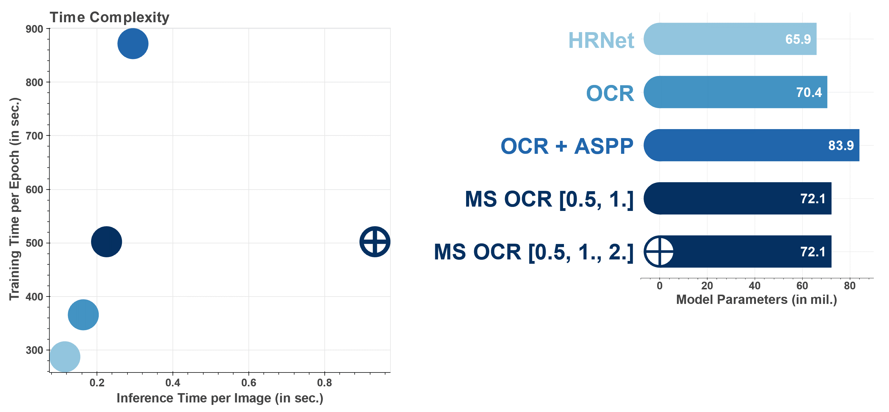
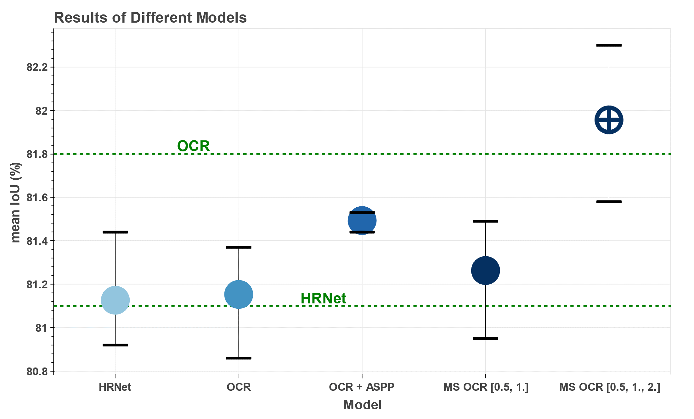
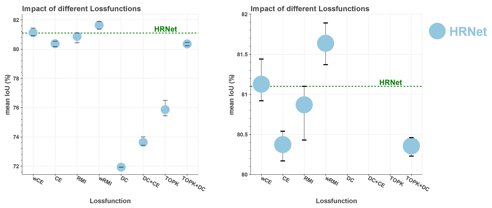

Todo:
- validation: catch invalid/old arguments
- get dataset size from dataloader not from config
- metric doc
- pretrained weightss doc
<div align="center">

# Semantic Segmentation Framework using Pytorch Lightning

 
  <a href="https://www.python.org/"></a>
  <a href="https://pytorch.org/get-started/locally/"></a>
  <a href="https://pytorchlightning.ai/"></a>
  <a href="https://albumentations.ai/"></a>
  <a href="https://hydra.cc/"></a>
</div>

This repository contains an easy-to-use and flexibly customizable framework for training semantic segmentation models.
This provides the ability to compare different state-of-the-art (SOTA) segmentation models under same conditions on different datasets.
Several architectures like [High-Resolution Network (HRNet)](https://arxiv.org/pdf/1904.04514.pdf), [Object Contextual Representation (OCR)](https://arxiv.org/pdf/1909.11065.pdf) and [Hierarchical Multi-Scale Attention (MS OCR)](https://arxiv.org/pdf/2005.10821.pdf) are already supported, 
as well as relevant datasets like [Cityscapes](https://www.cityscapes-dataset.com/) (coarse and fine) and [PASCAL VOC2010 Context](https://cs.stanford.edu/~roozbeh/pascal-context/) (59 and 60 classes).
Additionally, features like [Region Mutual Information (RMI)](https://arxiv.org/pdf/1910.12037.pdf) loss, mixed precision or multi-GPU training are provided among others.
This repository uses new and upcoming packages such as Pytorch Lightning and Hydra, and is designed to be extended with additional models and datasets, as well as other optimizers, schedulers, metrics, loss functions, and data augmentations.

The following contains information about how to [set up the data](#setting-up-the-data) and [run the code](#running-code).
A comparison between different SOTA approaches(HRNet, OCR,OCR+ASPP, MS OCR) on the Cityscapes and PASCAL VOC Context datasets is shown in the [experiments](#experiments) section.
For an advanced use of this framework, the [***config/* folder**](/config#walkthrough-the-config-jungle) contains a full explanation of all available configurations and how to customize the code to your needs.

### Overview

Overview about the results on the **Cityscapes val** set. 
The best result from three runs (mean intersection over union, mIoU) is reported.
A more detailed analysis is given in the [experiments](#experiments) section.

| Model              | Baseline | RMI loss | Paddle weights| Mapillary pretrained + RMI | Coarse Data | Coarse Data + RMI|
| -------------------|:--------:|:--------:|:-------------:|:--------------------------:|:------:|:---------:|
|HRNET               | 81.44    |  81.89   | 81.79         |                            | 82.03 |
|OCR                 | 81.37    |  82.08   | 81.89         |                            | 
|OCR + ASPP          | 81.53    |  82.20   |
|MS OCR [0.5, 1.]    | 81.49    |  82.59   |               |           84.45            | 82.26 | 83.54
|MS OCR [0.5, 1., 2.]| 82.30    |  82.88   |               |           84.92            | 82.95 | 83.96


### References
This repository adopts code from the following sources:
- **HRNet** ( High-Resolution Representations for Semantic Segmentation, [paper](https://arxiv.org/pdf/1904.04514.pdf), [source code](https://github.com/HRNet/HRNet-Semantic-Segmentation))
- **OCR** (Object Contextual Representation, [paper](https://arxiv.org/pdf/1909.11065.pdf), [source code](https://github.com/HRNet/HRNet-Semantic-Segmentation))
- **OCR + ASPP** (Combines OCR with an ASPP module, [source code](https://github.com/NVIDIA/semantic-segmentation/tree/main/network))
- **MS OCR** (Hierarchical Multi-Scale Attention for Semantic Segmentation, [paper](https://arxiv.org/pdf/2005.10821.pdf), [source code](https://github.com/NVIDIA/semantic-segmentation/tree/main/network))
- **RMI** (Region Mutual Information Loss for Semantic Segmentation, [paper](https://arxiv.org/pdf/1910.12037.pdf), [source code](https://github.com/ZJULearning/RMI))
- **DC** (Dice Loss), **DC+CE** (combination from Dice and Cross Entropy Loss), **TOPK**, **TOPK+DC** are all from nnUNet ([paper](https://www.nature.com/articles/s41592-020-01008-z), [source code](https://github.com/MIC-DKFZ/nnUNet))
# How To Run

## Requirements

Install the needed packages by:
````shell
pip install -r requirements.txt
````
Among others, this repository is mainly built on the following packages.
You may want to familiarize yourself with their basic use beforehand.

- **[Pytorch](https://pytorch.org/)**: The machine learning/deep learning library used in this repository.
- **[Pytorch Lightning](https://www.pytorchlightning.ai/):** 
An open source framework for organizing Pytorch code and supporting machine learning development.
It is automating most of the training loop and offers many useful features like mixed precision training.
Lightning also makes code scalable to any hardware(CPU, GPU, TPU) without changing the code, as well as distributed training on multiple GPUs.
- **[Hydra](https://hydra.cc/docs/intro/):** Framework to simplify the development, organization, and configuration of machine learning experiments.
It provides the ability to dynamically create a hierarchical configuration by composition and override it through config files and the command line.
- **[Albumentations](https://albumentations.ai):** Package for fast and flexible data augmentation in Semantic Segmentation (Albumentations is not limited to segmentation, but only that is used in this repository). 
Albumentations provides a lot of augmentations that can be used. Also random operations (e.g. random cropping) can be applied directly to images and masks.

  
## Setting up the Data

Currently, the following datasets are supported: Cityscapes, Cityscapes_coarse and Pascal Context Dataset(59 and 60 classes).
Follow the instructions below to set up the respective datasets
For adding other datasets look at the [customizing part](/config#dataset).

### Cityscapes
<details><summary>Click to expand/collapse</summary>
<p>

Download the Cityscapes dataset from [here](https://www.cityscapes-dataset.com/downloads/). 
You have to create an account and afterward download: *leftImg8bit_trainvaltest.zip* (11GB)  and *gtFine_trainvaltest.zip* (241MB).
Unzip them and put them into a folder, the structure of the folder should now look like this:
````
Datasets/cityscapes
    ├── leftImg8bit_trainvaltest
    │   └── leftImg8bit
    │       ├── train
    │       │   ├── aachen
    │       │   └── ...  
    │       └── val
    │           ├── frankfurt
    │           └── ...  
    └── gtFine_trainvaltest
        └── gtFine
            ├── test
            │   └── ...
            ├── train
            │   └── ...        
            └── val
                └── ...

````
The cityscapes dataset contain 34 classes by default but only 19 of them are used in practices.
To avoid doing this conversion at each training step, it is done in a preprocessing step.
To do this preprocessing run the following code with adjusting the data_path to the location which contains the *leftImg8bit_trainvaltest* and *gtFine_trainvaltest* folders. 
This will create a new img for each data sample with the converted class labeling which will be merged into the folder/data structure of the cityscapes dataset.
````
python datasets/utils/process_Cityscapes.py home/.../Datasets/cityscapes
````
After downloading and setting up the data, the last step is to adjust the path in the configuration.
Open the file of the environment you are using (by default *config/environment/local.yaml*) and adopt the cityscapes path to the location of the folder where your *gtFine_trainvaltest* and *leftImg8bit_trainvaltest* are.
For this example this would look like this:
````yaml
config/environment/local.yaml
─────────────────────────────
...
paths:
  cityscapes: /home/.../Datasets/cityscapes
````
</p>
</details>

### Cityscapes_Coarse
<details><summary>Click to expand/collapse</summary>
<p>

The cityscapes dataset provides 20k additional coarse labeled images
Since  cityscapes_coarse contains no validation data the fine annotated validation set is used for this purpose.
This is an extension to cityscapes rather than a separate dataset, so [cityscapes](#cityscapes) should be set up first. 
Afterwards download the cityscapes_coarse dataset from [here](https://www.cityscapes-dataset.com/downloads/). 
Download *leftImg8bit_trainextra.zip (44GB)* and *gtCoarse.zip (1.3GB)* and unzip them in the same folder as your cityscapes data.
You then should end up with this:
````
Datasets/cityscapes
    ├── leftImg8bit_trainvaltest
    │   └── leftImg8bit
    │       └── ...
    ├── gtFine_trainvaltest
    │   └── gtFine
    │       └── ...
    ├── leftImg8bit_trainextra
    │   └── leftImg8bit
    │       └── ...
    └── gtCoarse
        └── gtCoarse
            └── ...
````
Afterwards process the cityscapes_coarse dataset in the same way as it was done for cityscapes by:
````shell
python datasets/utils/process_Cityscapes_coarse.py home/.../Datasets/cityscapes
````

</p>
</details>

### PASCAL Context
<details><summary>Click to expand/collapse</summary>
<p>

Click [here](https://cs.stanford.edu/~roozbeh/pascal-context/trainval.tar.gz) for directly downloading the labels or do it manually by downloading the file *trainval.tar.gz (30.7 MB file)* from [PASCAL-Context](https://cs.stanford.edu/~roozbeh/pascal-context/#download). 
Click [here](http://host.robots.ox.ac.uk/pascal/VOC/voc2010/VOCtrainval_03-May-2010.tar) for directly downloading the images or do it manually by downloading the file *training/validation data (1.3GB tar file)* from [PASCAL VOC](http://host.robots.ox.ac.uk/pascal/VOC/voc2010/index.html#devkit).
Unzip both files and put them into a folder. 
The structure of you folders should look like this:

````
Datasets
    ├── VOCtrainval_03-May-2010/VOCdevkit/VOC2010
    │   ├── Annotations
    │   ├── ImageSets
    │   └── ...
    └── trainval
        └──trainval
            ├── *.mat
            └── ...
````
Since the VOC2010 dataset contains a lot of unnecessary stuff (unnecessary for this repo), only the needed data is extracted and merged with the transformed label data from *trainval/*.
Run the following script which creates a new folder structure with only the relevant and transformed data.
````shell
python datasets/utils/process_VOC2010_Context.py home/.../Datasets/
````
Afterward a new dataset is created and the data from *trainval* and *VOCtrainval_03-May-2010*  is not further needed.
The new dataset looks like this:
````
Datasets
    └── VOC2010_Context
        ├── Annotations
        │   ├── train
        │   └── val
        └── Images
            ├── train
            └── val
````
After downloading and setting up the data, the last step is to adjust the path in the configuration.
Open the file of the environment you are using (by default *config/environment/local.yaml*) and adopt the VOC2010_Context path to the location of the folder where your *Images* and *Annotations* are.
For this example this would look like this:
````yaml
config/environment/local.yaml
─────────────────────────────
...
paths:
    VOC2010_Context: /home/.../Datasets/VOC2010_Context
````

</p>
</details>

## Download Pretrained Weights

Pretrained weights for HRNet can be found here [here](https://github.com/HRNet/HRNet-Image-Classification#imagenet-pretrained-models).
Pretrained weights on ImageNet and PadddleClass weights are available.
Since all models (HRNet, OCR, OCR+ASPP, MS OCR) are using an HRNet backbone, these weights can be used for all of them.
For MS OCR pretrained weights on [Mapillary](https://github.com/NVIDIA/semantic-segmentation#download-weights) are available.
These Mapillary weights can be partially be used for the other models.
Download the preferred weights (direct download links below) and put them in the *pretrained/* folder.
- ImageNet weights: [download](https://1drv.ms/u/s!Aus8VCZ_C_33dKvqI6pBZlifgJk)
- PaddleClass weights: [download](https://github.com/HRNet/HRNet-Image-Classification/releases/download/PretrainedWeights/HRNet_W18_C_ssld_pretrained.pth)
- Mapillary weights: [download](https://drive.google.com/file/d/1Whz--rurtBoIsfF-t3YB9NEt3GT6hBQI/view?usp=sharing)

## Running Code

The following is a **Quickstart** guide on how to run the code.
A detailed explanation of all configurations and how they can be used can be found in the [*config/* folder](/config#walkthrough-the-config-jungle). 
After setting up the data and downloading the pretrained weights, you can directly run the baseline by:
````shell
python main.py
````
This trains HRNet on the Cityscape Dataset with default settings.
To adopt the configuration you can edit the */config/baseline.yaml* file directly or use the hydra commandline syntax. 
You can change the model from the commandline by:
````shell
python main.py model=hrnet
python main.py model=hrnet_ocr
python main.py model=hrnet_ocr_aspp
python main.py model=hrnet_ocr_ms         #How to validate with multiple scales is shown below
````
In the same way dataset can be changed by:
````shell
python main.py dataset=Cityscapes               # Using Cityscapes with fine annotated data
python main.py dataset=Cityscapes_coase         # for using the coarse annotated data
python main.py dataset=Cityscapes_fine_coase    # for using both, fine and coarse annotated data
python main.py dataset=VOC2010_Context          # by default VOC2010_Context dataset is used with 59 classes
python main.py dataset=VOC2010_Context_60       # for using the 60 class setting
````
Also basic hyperparameters needed for training can be set by:
````shell
python main.py epochs=400 batch_size=6 val_batch_size=6 num_workers=10 lr=0.001 wd=0.0005 momentum=0.9
````
For validation/testing under different conditions (e.g. additional scale for MS OCR, or multiscale testing for VOC2010_Context) run the following command.
Consider that checkpointing hast to be enabled when training an experiment (``python main.py .... pl_trainer.enable_checkpointing=True`` or set to True in 'baseline.yaml') to validate/test it afterwards
For MS OCR and VOC2010_Context a predefined validation setting is used, to change these or create a custom on look [here](/config#testing).
````shell
python validation.py --valdir=<path.to.the.outputdir.of.training>
# eg python validation.py --valdir="/../Semantic_Segmentation/logs/VOC2010_Context/hrnet/baseline__/2022-02-15_13-51-42"
````
As you can see the basic syntax how to run the code is simple. 
The crucial thing is to know which parameters you can configure and how.
Therefore, the [*config/* folder](/config) explains in detail how the configuration is composed and which parameters it contains.
Some more examples on how to run the code are given below in the [experiment](#experiments) section.

The output/logging behaviour of the code will look like this:

````
LOGDIR                                      # logs/ by default
    └── Dataset                             # Name of the used Dataset
        └──Model                            # Name of the used Model
           └──experiment_overrides          # Parameters that have been overwritten and differ from the baseline
              └──Date                       # Date as unique identifier
                  ├── checkpoints/          # if checkpointing is enabled this contains the best and the last epochs checkpoint
                  ├── hydra/                # contains hydra files
                  ├── validation/           # optional (only when model is validated) - contains testing results
                  ├── ConfusionMatrix.pt    # Confusion Matrix of best epoch, for the case that other metrics are needed
                  ├── event.out...          # Tensorboard log
                  ├── main.log              # logging
                  └── hparams.yaml          # resolved config
````

# Experiments

## Cityscapes

The following experiments were performed under the following training settings and the reported results are for the Cityscapes validation set.
Stochastic Gradient Descent(SGD) with *momentum = 0.9* and *weight decay = 0.0005* is used for optimization. 
The models are trained with an initial learning rate of 0.01 and a polynomial learning rate scheduler.
These setting have established themselves as a kind of standard for cityscapes and are therefore also used here.
Additionally, the batch size is set to 12 and the number of epochs to 400 (see [Defining the Baseline](#defining_the_baseline)).
For data augmentation the images are randomly scaled to a range of [0.5, 2] and randomly cropped to a size of 1024x512 afterwards.
Besides that, only random flipping and normalization is performed.
By default the models are pretrained weights on ImageNet are used.
If not specified, training is done on 2 GPUs (with a batch size of 6 per GPU) and each experiment is run 3 times.
The *MS OCR* model is trained with two scales (*[0.5, 1.]*) during training and for inference a third (*[0.5, 1., 2]*) is added.
Typically, both settings are evaluated in the following experiments.

### Time Complexity

The following figure shows the training and inference time of each model, as well as the number of parameters.
It can be seen that the number of parameters is in a similar range for all models, but still as the number of parameters increases, the time complexity of the models also increases.
Thereby OCR-ASPP has by far the highest training time.
Using an additional scale to MS OCR highly increases the inference time of the model. 
That's why MS OCR [0.5, 1.] is used for training and only for inference MS OCR [0.5, 1., 2] is used (that's why both have the same training time)
The runtime measurements are done using a single GPU (NVIDIA GeForce RTX 3090). 
To fit on a single GPU, the batch_size is reduced compared to the baseline.



### Defining the Baseline

#### Number of Epochs and Batch Size

Looking at further hyperparameters, it can be seen that the batch size in particular is critical.
For good results a large batch size is mandatory, so a GPU with sufficient memory or multiple GPUs with synchronized batch normalization should be used.
If these hardware requirements cannot be fulfilled, [accumulate gradient batches](https://pytorch-lightning.readthedocs.io/en/stable/advanced/training_tricks.html#accumulate-gradients) can be used instead.
This will not have exactly the same effect but will still help to increase the effective batch size.
With the number of epochs, the fluctuation is much smaller, but a suitable value is still important.
In green, the HRNet results reported in the corresponding paper are shown for comparison.
Resulting from the experiments, a batch size of 12 and 400 epochs are used for further experiments.


<details><summary>Scrips</summary>
<p>

Running HRNet for different number of epochs
````shell

python main.py epochs=150
python main.py epochs=200
python main.py epochs=250
python main.py epochs=300
python main.py epochs=350
python main.py epochs=400
python main.py epochs=450
python main.py epochs=500
````
Running HRNet with different batch sizes (ON A SINGLE GPU)
````shell
#for the same number of epochs
python main.py batch_size=4 epochs=400
python main.py batch_size=6 epochs=400
python main.py batch_size=8 epochs=400
python main.py batch_size=10 epochs=400
python main.py batch_size=12 epochs=400
python main.py batch_size=14 epochs=400
````
````shell
#for the same number of steps
python main.py batch_size=4 epochs=134
python main.py batch_size=6 epochs=201
python main.py batch_size=8 epochs=268
python main.py batch_size=10 epochs=334
python main.py batch_size=12 epochs=400
python main.py batch_size=14 epochs=468
````

</p>
</details>

#### Mixed Precision 

The use of [Mixed Precision](https://pytorch-lightning.readthedocs.io/en/latest/advanced/mixed_precision.html#mixed-precision) reduces the training time of the models by 20 to 30%.
In addition, Mixed Precision was able to improve the results in these experiments.
Since Mixed Precision has a positive effect and the training time is drastically reduced, Mixed Precision is used as default for further experiments.


<details><summary>Scrips</summary>
<p>

Training with Mixed Precision
````shell
python main.py epochs=150
python main.py epochs=200
python main.py epochs=250
python main.py epochs=300
python main.py epochs=350
python main.py epochs=400
python main.py epochs=450
python main.py epochs=500
````
Training without Mixed Precision
````shell
python main.py pl_trainer.precision=32 epochs=150
python main.py pl_trainer.precision=32 epochs=200
python main.py pl_trainer.precision=32 epochs=250
python main.py pl_trainer.precision=32 epochs=300
python main.py pl_trainer.precision=32 epochs=350
python main.py pl_trainer.precision=32 epochs=400
python main.py pl_trainer.precision=32 epochs=450
python main.py pl_trainer.precision=32 epochs=500
````

</p>
</details>


### Different Models

After defining the baseline on HRNet, other models are also trained and validated under same conditions.
As can be seen, OCR gives quite similar results to HRNet in these experiments. 
What is also noticeable, in contrast to HRNet, the results documented in the paper cannot be achieved with OCR
(it must be said that the baseline used in the OCR paper is slightly different from the one used here).
The use of an additional ASPP module leads to a slight improvement in the OCR results, but significantly increases the time complexity of the model.
Using MS OCR with two scales gives similar results to the other networks, but adding a third scale gives by far the best results.



<details><summary>Scrips</summary>
<p>

Training the different Models
````shell
python main.py model=hrnet
python main.py model=hrnet_ocr
python main.py model=hrnet_ocr_aspp
python main.py model=hrnet_ocr_ms
````

</p>
</details>


### Different Loss Funcitons 

Looking at the different loss functions, it can be seen that the best results can be achieved with Cross-Entropy (CE) and Region Mutual Information (RMI).
Dice Loss based functions are way behind. 
With changes to the lr and number of epochs, these can be tuned somewhat, but are still significantly worse.
What is also seen is that the use of weights (wCE and wRMI) to compensate for class imbalances in Cityscapes significantly improve the results.
Only HRNet is used for this experiments.




<details><summary>Scrips</summary>
<p>

Training HRNet with different loss functions
````shell
python main.py lossfunction=CE
python main.py lossfunction=wCE
python main.py lossfunction=RMI
python main.py lossfunction=wRMI
python main.py lossfunction=DC
python main.py lossfunction=DC_CE
python main.py lossfunction=TOPK
python main.py lossfunction=DC_TOPK
````

</p>
</details>

### Close look at RMI loss 

As seen in the previous experiments, using the RMI loss gives the best results, so this is tested with the other models as well.
RMI loss results in significantly increased mIoU (compared to CE) for all models.
However, it also leads to an increased runtime.
To keep this increase as low as possible, RMI loss is only used during training and CE loss is still used during validation (validation loss).


<details><summary>Scrips</summary>
<p>

````shell
#Running HRNet with CE and RMI loss
python main.py lossfunction=wCE
python main.py lossfunction=wRMI
#Running OCR with CE and RMI loss
python main.py model=hrnet_ocr lossfunction=[wCE,wCE]
python main.py model=hrnet_ocr lossfunction=[wRMI,wCE]
#Running OCR + ASPP with CE and RMI loss
python main.py model=hrnet_ocr_aspp lossfunction=[wCE,wCE]
python main.py model=hrnet_ocr_aspp lossfunction=[wRMI,wCE]
#Running MS OCR with CE and RMI loss
python main.py model=hrnet_ocr_ms lossfunction=[wCE,wCE,wCE,wCE]
python main.py model=hrnet_ocr_ms lossfunction=[wRMI,wCE,wCE,wCE]
````

</p>
</details>

### Available Data

Since the previous experiments focused on model and training parameters, a closer look at the used data is given here.
For the baseline so far ImageNet pretrained weights are used.
Comparison of the results with models without additional data (trained from scratch) shows that the use of pre-trained weights has a large impact in these experiments.
The use of PaddlClass weights can further enhance results, and the best results can be achieved by pretraining on Mapillary.
The reason for this is the similarity of Mapillary to Cityscapes (both urban setting).
Besides this, the use of the coarsen cityscapes data can also improve the results.
Three different strategies how to integrate the additional data are tested.
The bes result are from Strategy 2 when the model is first trained on fine data, afterwards the model is finetuned (with reduced lr) with only the coarse data and finally the model is finetuned again (with reduced lr) on the fine data.
To achieve highscores the use of coarse data is combined with RMI loss.
However, RMI loss is only used for fine data, as it has been shown to not work as well for coarsely annotated data.
In the end, the best results were achieved in this way and with MS OCR.


MAPILLARY RESULTS ARE IN PROGRESS, FIGURE WILL BE UPDATED SOON

<details><summary>Scrips</summary>
<p>

Training Models without pretraining on ImageNet
````shell
python main.py model=hrnet MODEL.PRETRAINED=False
python main.py model=hrnet_ocr MODEL.PRETRAINED=False
python main.py model=hrnet_ocr_aspp MODEL.PRETRAINED=False
python main.py model=hrnet_ocr_ms MODEL.PRETRAINED=False
````
Training Models with pretrained weights on ImageNet
````shell
#Running Different Models
python main.py model=hrnet
python main.py model=hrnet_ocr
python main.py model=hrnet_ocr_aspp
python main.py model=hrnet_ocr_ms MODEL.MSCALE_TRAINING=False
````
Training Models with coarse data
````shell
#HRNET
python main.py model=hrnet
python main.py model=hrnet epochs=25 lr=0.001 dataset=Cityscapes_coarse +finetune_from=<path.to.ckpt.of.previous.line>
python main.py model=hrnet epochs=65 lr=0.001 +finetune_from=<path.to.ckpt.of.previous.line>
#MS OCR
python main.py model=hrnet_ocr_ms 
python main.py model=hrnet_ocr_ms  epochs=25 lr=0.001 dataset=Cityscapes_coarse +finetune_from=<path.to.ckpt.of.previous.line>
python main.py model=hrnet_ocr_ms  epochs=65 lr=0.001 +finetune_from=<path.to.ckpt.of.previous.line>
````


</p>
</details>


## PASCAL VOC2010 Context

**IN PROGRESS**
