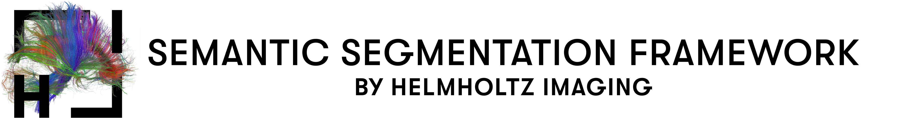

<p align="left">
  
</p>

# Walkthrough of the Config Jungle

In this repository [Hydra](https://hydra.cc/) is used for configuring and managing experiments.
Therefore, configuration files and their handling are of major importance, which is why they are
explained in more detail below.
First, the basic functionality of Hydra will be briefly explained.
At first glance, the use of Hydra may make the configuration more complicated and confusing, but
this will quickly disappear if you familiarize yourself with it a bit.
The advantage that Hydra provides is the ease of managing experiments and to easily add new models
or datasets (and more) without changing the base code.
Since Hydra uses the [OmegaConf](https://omegaconf.readthedocs.io/en/2.1_branch/) package to
handle *.yaml* files, Omegaconf and YAML are also briefly introduced.

## Basics

[Hydra](https://hydra.cc/) automatically loads and composes different configuration files and allows
to dynamically override values at runtime via the command line.
In Hydra, *.yaml* files are used to set configurations.
In this repository the *config/baseline.yaml* can be seen as the main file from which other
configurations are composed.
Each subfolder in *config/* is
a [config group](https://hydra.cc/docs/tutorials/basic/your_first_app/config_groups/), which
contains a separate config file for each alternative inside.
For example the config group *model* is located in the *config/model* subfolder with a separate *
.yaml* file for each available model (hrnet.yaml, hrnet_ocr.yaml, ...).
The individual config files contain model/dataset/etc. specific parameters, such as the number of
channels in a layer of the model or the number of classes in a dataset.
Having a separate config file for each model/dataset/etc. makes it easy to switch between them and
arbitrarily combine different config files from different config groups.
Additionally, this ensures that only the relevant parameters are loaded into the job configuration.
Hydra creates the [job configuration](https://hydra.cc/docs/1.0/configure_hydra/job/) by composing
the configuration files from the different configuration groups.
Basically, exactly one config file from each config group is used in this process
(as an exception, a config group can be declared as optional, this will then only be used if it is
explicitly defined).
To tell hydra how to compose the job configuration,
a [default list](https://hydra.cc/docs/tutorials/basic/your_first_app/defaults/) is used, which
specifies which configuration file from which configuration group should be used and in which order
they are composed.
The default list in this repository is defined in *config/baseline.yaml* and looks like this:

````yaml
baseline.yaml
  ─────────────────────────────
defaults:
  - _self_
  - hyperparameters/default     # Load Default Hyperparameters
  - optional hyperparameters:   # (Optional) Overwrite defaults with the specific hyperparameter config
  - optimizer: SGD              # Optimizer
  - lr_scheduler: polynomial    # Learning rate scheduler
  - callbacks: default          # Callbacks
  - data_augmentation: default  # Data Augmentation Pipeline
  - metric: mean_IoU            # Metric configuration
  - dataset: Cityscapes         # Dataset
  - model: hrnet                # Model
  - environment: local          # Environment
````

The configs of each config group are merged from top to bottom, where later groups can overwrite the
parameters of earlier groups.
In addition to the order, the default list also sets default values for the configuration groups.
This means if not changed, the parameters defined in *hyperparameters/default.yaml*,..., *datasets/Cityscapes.yaml*
and *model/hrnet.yaml* are used in this case.
To change the used config file of a config group, the corresponding entry in the default list can be
changed in the *baseline.yaml*, or the entry can be overwritten from the commandline.
Hydra's [commandline syntax](https://hydra.cc/docs/advanced/override_grammar/basic/#working-with-your-shell)
is straight forward and elements can be changed, added or removed in the following ways.
Thereby this syntax is the same for single parameters like *batch_size* as well as for config files
from config groups like *model*.
All available options to change for parameters and config groups are shown below in
the [Configure the Configuration](#configure-the-configuration) part.

````shell
python main.py  parameter_to_change=<new_value>  +parameter_to_add=<a_value>  ~parameter_to_delete
#Example for single parameters
python main.py  batch_size=3 +extra_lr=0.001 ~momentum
#Example for config groups
python main.py  model=hrnet_ocr +parameter_group=default ~environment   
````

Another important concept of Hydra is the ability
to [instantiate objects](https://hydra.cc/docs/advanced/instantiate_objects/overview/).
This enables to fully define classes in the config files and then instantiate them in the code.
An example for both is shown below.
The reason for doing this is that it is possible to add new optimizers, models, datasets etc. from
the config without having to change the base code.
This makes this repository easy to change and flexible to extend without having to search yourself
through the implementation.
For example, to use or define another optimizer in the example below, only the optimizer entry in
the *example.yaml* has to be changed.

````yaml
example.yaml
  ─────────────────────────────
# Generall syntax
name:
  _target_: path.to.class
  arg1:     some_argument
  arg2:     ...
# Example for defining a torch-optimizer
optimizer:
  _target_:     torch.optim.SGD
  lr:           0.01
  momentum:     0.9
  weight_decay: 0.005
# Another example for defining a custom class object
metric:
  _target_:    utils.metric.ConfusionMatrix
  num_classes: 24
````

````py
example.py
─────────────────────────────
my_optimizer = hydra.utils.instantiate(cfg.optimizer)
my_metric = hydra.utils.instantiate(cfg.metric)
````

This was only a short introduction how to use hydra to work with this repository.
For more information on Hydra, check out the official docs or one of the following sources, which
provide some nice insights into Hydra
([source1](https://github.com/lkhphuc/lightning-hydra-template),
[source2](https://www.sscardapane.it/tutorials/hydra-tutorial/),
[source3](https://towardsdatascience.com/complete-tutorial-on-how-to-use-hydra-in-machine-learning-projects-1c00efcc5b9b)
and
[source4](https://github.com/ashleve/lightning-hydra-template)).

## OmegaConf in a Nutshell

<details><summary>Click to expand/collapse</summary>
<p>

Hydra uses the package [OmegaConf](https://omegaconf.readthedocs.io/en/2.1_branch/) to handle *
.yaml* files.
OnegaConf gives a lot of possibilities to work with *.yaml* files, but since hydra manages this for
you in the background you do not need much of it for a basic use.
If you need further functionality, for example if you manually want to load or save files look
at the official [OmegaConf docs](https://omegaconf.readthedocs.io/en/2.1_branch/).
The [**Access and
Manipulation**](https://omegaconf.readthedocs.io/en/latest/usage.html#access-and-manipulation) of
the cfg in python is straight forward:

````yaml
example.yaml
  ─────────────────────────────
Parameters:
  lr:     0.01
  epochs: 100
  whatever:
    - 42
    - ...
````

````python3
main.py
─────────────────────────────
from omegaconf import OmegaConf

...
# For the example load the cfg manually, which is normally done automatically by hydra
cfg = OmegaConf.load("example.yaml")

# Access over object and dictionary style
lr = cfg.Parameters.lr
lr = cfg["Parameters"]["lr"]

# Manipulation in the same way
cfg.Parameters.epochs = 300
cfg["Parameters"]["epochs"] = 300

# The same goes for accessing lists
x = cfg.Parameters.whatever[0]
````

[**Variable
interpolation**](https://omegaconf.readthedocs.io/en/latest/usage.html#variable-interpolation) is
another important concept of Hydra and Omegaconf.
When defining config files the situation will occur that variables from other config files are
needed.
For example for defining the last layer of a model, the number of classes, which is defined in the
specific dataset configs, may be needed.
Therefore, variable interpolation is used, which can be seen as a link to a position in the config,
that is resolved at runtime.
Therefore, the variable is resolved from the dataset which used the current job and no conflicts
occur between different dataset configs and the model config.
Variable interpolation is done with the following syntax:``${path.to.another.node.in.the.config}``.
and in that case the value will be the value of that node.

````yaml
dataset/a_dataset.yaml
  ─────────────────────────────
  #@package _global_
...
dataset:
  num_classes: 24
````

````yaml
model/a_model.yaml
  ─────────────────────────────
  #@package _global_
...
num_output_classes: ${dataset.number_classes} # num_output_classes will have the value 24 at runtime
````

</p>
</details>

## YAML in a Nutshell

<details><summary>Click to expand/collapse</summary>
<p>

This is only a short introduction to YAML and only shows its basic syntax. This should be enough for
defining your own yaml files, but if you need more information they can be
found [here](https://docs.ansible.com/ansible/latest/reference_appendices/YAMLSyntax.html) for
example.
The following examples are for Yaml in combination with OmegaConf and may not work for yaml alone.

Some  **Basic Assignments** are shown here:

````yaml
example.yaml
  ─────────────────────────────
# Comments in yaml
number: 10                   # Simple value, works for int and float.
string: Text|"Text"          # Strings, Quotation marks are not necessarily required.
empty: None| |Empty|Null
explicit_Type: !!float 1     # Explicitly defined type. works as well for other types like str etc.
missing_vale: ???            # Missing required value. The  has to be given e.g. from the commandline.
optional opt_value:          # Optional Value. Can be empty or ???, and will only be considered if it has a value.
value2: ${number}            # Value interpolation (takes the value of attribute number, in this 
                             # case 10). $ indicates reference and {} is required.
value3: "myvalue ${number}"  # String interpolation, same as value interpolation just with string output.
booleans: on|off|yes|no|true|false|True|False|TRUE|FALSE    #multiple possibilities to define boolean values.
````

**List** are defined in the following way:

````yaml
alist:
  - elem1                      # Elements need to be on the same indentation level
  - elem2                      # There needs to be a space between dash and element
  - ...
samelist: [ elem1, elem2, ... ]               # The same list can also be defined with this syntax
````

**Dictionaries** are defined in the following way:

````yaml
adict:
  key1: val1                    # Keys must be indented
  key2: val2                    # There has to be a space between colon and value
  ...                           # Each key may occur at most once
samedict: { key1: val1, key2: val2, ... }     # The same dict can also be defined with this syntax
````

For more complex files you will end up with lists of dictionaries and dictionaries of list and
mixtures of both. But basically that's it!

</p>
</details>

# Configure the Configuration

In the following, each configuration group and some other features are explained in detail.
First, the provided functionality is explained and afterwards it is described how this can be
customized, for example to add a new model or a new dataset to the framework.

## Model

<details><summary>Configure</summary>
<p>

Currently, the following models are supported, by default hrnet is used. 
How to select a model and the used pretrained weights is explained [here](../config#selecting-a-model).

- **hrnet**: [High-Resolution Network (HRNet)](https://arxiv.org/pdf/1904.04514.pdf). Segmentation
  model with a single output.
- **hrnet_ocr**: [Object-Contextual Representations (OCR)](https://arxiv.org/pdf/1909.11065.pdf).
  A HRNet backbone with an OCR head.
  The model has two outputs, a primary and an auxiliary one.
- **hrnet_ocr_aspp**: Additionally including an ASPP module into the ORC model. Again the model has
  two outputs.
- **hrnet_ocr_ms**: [Hierarchical Multiscale Attention Network](https://arxiv.org/pdf/2005.10821.pdf).
  Extends ORC with multiscale and attention.
  The model has 4 outputs: primary, auxiliary, high_scale_prediction, low_scale_prediction
    - ``MODEL.MSCALE_INFERENCE`` is used to enable/disable the use of multiple scales (only during
      inference and validation), which is False by default.
    - ``MODEL.N_SCALES`` defines the scales which are used during *MSCALE_INFERENCE*, by default *= [0.5, 1.0, 2.0]*
- **FCN**: including torchvision's FCN  ([docs]((https://pytorch.org/vision/stable/models.html#fully-convolutional-networks)), [paper](https://arxiv.org/pdf/1411.4038.pdf)).
Besides the arguments described in the [torchvision docs](https://pytorch.org/vision/stable/generated/torchvision.models.segmentation.fcn_resnet101.html#torchvision.models.segmentation.fcn_resnet101) you can specify the following arguments:
  - ``model.backbone`` can be resnet50 or resnet101, to define which version of the model should be used. resnet101 by default.
- **DeepLab**: including torchvision's DeepLabv3 ([docs]((https://pytorch.org/vision/stable/models.html#deeplabv3)), [paper]()). 
Besides the arguments described in the [torchvision docs](https://pytorch.org/vision/stable/generated/torchvision.models.segmentation.deeplabv3_resnet101.html#torchvision.models.segmentation.deeplabv3_resnet101) you can specify the following arguments:
  - ``model.backbone`` can be resnet50 or resnet101, to define which version of the model should be used. resnet101 by default.
- **UNet**: Implementation of UNet ([paper](https://www.nature.com/articles/s41592-020-01008-z)
  , [source code](https://github.com/MIC-DKFZ/nnUNet)). No pretrained weights are available

</p>
 </details>

<details><summary>Customize</summary>
<p>

Defining a custom model is done in two steps, first defining your custom pytorch model and
afterwards setting up its config file.

1. **Defining your Pytorch Model**, thereby the following thinks have to be considered:
    - **Model Input**: The input of the model will be a torch.Tensor of shape [batch_size, channels, height, width]).
    - **Model Output**: It is recommended that your model **return a dict** which contain all the models outputs.
      The naming can be arbitrary but the ordering matters. 
      For example if you have one output return as follows: ``return {"out": model_prediction}``. If
      you have multiple output to it analogues:
      ``return {"main": model_prediction, "aux": aux_out}``.
      The output of the model can also be a single Tensor, a list or a tuple, but in this case the output is converted into dict automatically.
      It should be noted that in each case the **order of the outputs is relevant**. Only the first output is
      used for updating the metric during validation or testing.
      Further the order of the outputs should match the order of your losses in *lossfunction* and
      the weights in *lossweights*.(see [Lossfunction](#loss-function) for more details on that)

2. **Setting up your model config**
    - Create a *custom_model.yaml* file in *config/model/*. Therby the name of the file defines how the model can be select over hydras commandline syntax.
   For the content of the *.yaml* file adopt the following dummy. Node that *MODEL.NAME* is required.

````yaml 
#@package _global_
# model is used to initialize your custom model, 
# _target_: should point to your model class or a getter function which returns your model
# afterwards you can handle your custom input arguments which are used to initialize the model
model:
   _target_: models.my_model.get_model     # if you want to use a getter function to load weights 
                                           # or initialize you model
   #_target_: models.my_model.Model        # if you want to load the Model directly
   num_classes:  ${DATASET.NUM_CLASSES}    # example arguments, for example the number of classes
   pretrained: ${MODEL.PRETRAINED}         # of if pretrained weights should be used
   arg1: ...
# model is used to store information which are needed for your model
MODEL:
  # Required model arguments
  NAME: MyModel            # Name of the model is needed for logging
  # Your arguments, for example somethinnk like that
  PRETRAINED: True         # e.g. a parameter to indicate if pretrained weights should be used 
  PRETRAINED_WEIGHTS: /pretrained/weights.pth  # give the path to the weights      
````
3. **Train your model**
   ````shell
    python main.py model=custom_model     # to select config/model/custom_model.yaml
    ````

</p>
</details>

## Dataset

<details><summary>Configure</summary>
<p>

Currently, the following datasets are supported, and they can be selected as shown [here](../config#selecting-a-dataset). 
By default, the cityscapes dataset is used.

- **Cityscapes**: [Cityscapes dataset](https://www.cityscapes-dataset.com/) with using fine
  annotated images. Contains 19 classes and 2.975 training and 500 validation images.
- **Cityscapes_coarse**: [Cityscapes dataset](https://www.cityscapes-dataset.com/) with using coarse
  annotated training images. Contains 19 classes and ~20.000 training images.
  For validation the 500 fine annotated images from Cityscape are used.
- **Cityscapes_fine_coarse**: [Cityscapes dataset](https://www.cityscapes-dataset.com/) with using
  coarse and fine annotated training images. Contains 19 classes and ~23.000 training images.
  For validation the 500 fine annotated images from Cityscape are used.
- **VOC2010_Context**: [PASCAL Context](https://cs.stanford.edu/~roozbeh/pascal-context/) dataset,
  which is an extension for
  the [PASCAL VOC2010 dataset](http://host.robots.ox.ac.uk/pascal/VOC/voc2010/) and contains
  additional segmentation masks.
  It contains 5.105 training and 4.998 validation images.
  This dataset contains 59 classes. For the 60 class setting see below.
- **VOC2010_Context_60**: The **VOC2010_Context** dataset with an additional background class,
  resulting in a total of 60 classes.

</p>
 </details>

<details><summary>Customize</summary>
<p>

Defining a custom dataset is done in two steps, first defining your custom pytorch dataset and
afterwards setting up its config file.

1. **Defining your pytorch Dataset**, thereby consider that the following structure is required (
   mainly pytorch basic) and see the dummy below:
    - \__init__(self, custom_args, split, transforms):
        - *custom_args*: your custom input arguments (for example data_root etc.). They will be
          given to your dataset from the config file (see below).
        - *split*: one of the following strings: \["train","val","test"]. To define if train,
          validation or test set should be returned.
        - *transforms*: Albumentations transformations
    - \__getitem__(self, idx):
        - getting some index and should the output should look similar to: *return img, mask*
        - with ````img.shape = [c, height, width]```` and ````mask.shape = [height, width]````,
          where *c* is the number of channels. For example *c=3* if you use RGB data.
    - \__len(self)__:
        - return the number of samples in your dataset, something like: *return len(self.img_files)*
   ````py
   class Custom_dataset(torch.utils.data.Dataset):
    def __init__(self,root,split,transforms):
        # get your data for the corresponding split
        if split=="train":
             self.imgs = ...
             self.masks = ...
        if split=="val" or split=="test":       # if you have dont have a test set use the validation set
             self.imgs = ...
             self.masks = ...
        
        # save the transformations
        self.transforms=transforms

    def __getitem__(self, idx):
        # reading images and masks as numpy arrays
        img =cv2.imread(self.imgs[idx])
        img = cv2.cvtColor(img, cv2.COLOR_BGR2RGB)  # cv2 reads images in BGR order

        mask=cv2.imread(self.masks[idx],-1)

        # thats how you apply Albumentations transformations
        transformed = self.transforms(image=img, mask=mask)
        img = transformed['image']
        mask = transformed['mask']
        
        return img, mask.long()

    def __len__(self):
        return len(self.imgs)
   ````
2. **Setting up your dataset config**
    - Create a *custom_dataset.yaml* file in *config/datasets/*. For the content of the *.yaml* file
      adopt the following dummy:

   ````yaml 
   #@package _global_
   # dataset is used to initialize your custom dataset, 
   # _target_: should point to your dataset class
   # afterwards you can handle your custom input arguments which are used to initialize the dataset
   dataset:
     _target_: datasets.MyDataset.Custom_dataset 
     root: /home/.../Datasets/my_dataset     #the root to the data as an example input
     #root: ${path.my_dataset}               #the root if defined in config/environment/used_env.yaml
     input1: ...                    #All your other input arguments
     input2: ...
   # DATASET is used to store information about the dataset which are needed during training
   DATASET:
     # Required dataser arguments
     NAME:            # Used for the logging directory
     NUM_CLASSES:     # Needed for defining the model and the metrics
     # (Optional) but needed if ignore index should be used
     IGNORE_INDEX:    # Needed for the loss function, if no ignore indes set to 255 or another number
                      # which do no occur in your dataset 
     # (Optional) needed if weighted lossfunctions are used
     CLASS_WEIGHTS: [ 0.9, 1.1, ...]                
     # (Optional) can be used for nicer for logging 
     CLASS_LABELS:
        - class1
        - class2 ...
   ````
3. **Train on your Dataset**
   ````shell
    python main.py dataset=custom_dataset     # to select config/dataset/custom_dataset.yaml
    ````


</p>
</details>

## Hyperparameters and Pytorch Lightning Trainer

<details><summary>Configure</summary>
<p>

#### Hyperparameters

The default hyperparameters are defined in *config/hyperparameters/default.yaml*. 
For the specific datasets they are overwriten from *config/hyperparameters/<dataset.name>.yaml*
The following hyperparameters are supported and can be changed in the *.yaml*-files directly or
can be overwritten from the command line as shown below.

- **epochs:** number of epochs for training.
- **batch_size:** defines the batch size during training (per GPU).
- **val_batch_size:** defines the batch size during validation and testing (also per GPU). Is set to
  batch_size if not specified.
- **num_workers:** number of workers for the dataloaders.
- **lr:** initial learning rate for training.

 ```` shell
 python main.py epochs=100 batch_size=7 val_batch_size=3 num_workers=4 lr=0.001
  ```` 

#### Pytorch Lightning Trainer

Since Pytorch Lightning is used as training framework, with the trainer class as central unit,
some additional parameters can be defined by passing them to the Pytorch Lightning Trainer.
The *pl_trainer* entry in the baseline.yaml is used for this purpose.
By default, this looks like the following and arguments can be overwritten/added/removed as shown
below:

```` yaml
baseline.yaml
------------------
pl_trainer:                     # parameters for the pytorch lightning trainer
  max_epochs: ${epochs}         # parsing the number of epochs which is defined as a hyperparameter
  gpus: -1                      # defining the used GPUs - in this case using all available GPUs
  precision: 16                 # using Mixed Precision
  benchmark: True               # using benchmark for faster training
````

````shell
# Overwriting
python main.py pl_trainer.precision=32 pl_trainer.benchmark=false
# Adding
python main.py +fast_dev_run=True +pl_trainer.reload_dataloaders_every_n_epochs=2 
# Removing
python main.py ~pl_trainer.precision 
````

A full list of all available options of the Pytorch Lightning Trainer class can be seen in
the [Lightning docs](https://pytorch-lightning.readthedocs.io/en/stable/common/trainer.html#trainer-class-api). \
Some arguments are defined inside the code and can't be overwritten from the config file.
These parameters are not intended to be changed, if you still want to adapt them you can do this
in *main.py* in the *training_loop* function.
The effected parameters are:

- *callbacks*: callbacks are defined in *config/callbacks*, so add your callbacks there
- *logger*: tb_logger is used by default
- *strategy*: ddp if multiple gpus are used, else None
- *sync_batchnorm*: sync_batchnorm is True if multiple gpus are used, else False

</p>
</details>

<details><summary>Customize</summary>
<p>

Hyperparameters can be added or changed in *.yaml*-files or from the commandline.
For different experiments, a group of parameters may need to be adjusted at once.
To not have to change them manually each time there is an optional *hyperparameters* config group to
easily switch between different hyperparameter settings.
Create *hyperparameters/my_hparams.yaml* and insert all parameters that differ from the default.yaml
into it.
A dummy and how this can be used it shown below:

````yaml
config/hyperparameters/my_hparams.yaml
  ─────────────────────────────
# @package _global_
batch_size: 6
val_batch_size: 4
epochs: 175
lossfunction: RMI
...
# Also fo Pytorch Lightning Trainer Arguments
pl_trainer:
  precision: 32
  ...               
````

````shell
python main hyperparameters=my_hparams
````

</p>
</details>

## Optimizer

<details><summary>Configure</summary>
<p>

Currently [Stochastic Gradient Descent (SGD)](https://pytorch.org/docs/stable/generated/torch.optim.SGD.html)
is the only supported optimizer.
SGD can be adapted by changing the following parameters in the *baseline.yaml* of from the command
line.
Since the pytorch implementation of SGD is used also other parameters of the SGB class, like
nesterov, can be passed:

- **weight_decay:** default = 0.0005
- **momentum:** default = 0.9

````shell
python main weight_decay=0.0001 momentum=0.8 +optimizer.nesterov=True
````

</p>
</details>

<details><summary>Customize</summary>
<p>

To add a custom optimizer create a *my_optimizer.yaml* file in *config/optimizer/*.
A dummy and how this can be used it shown below.
Besides the arguments which are defined in the config the optimizer will be also initialized with
the model parameters in the following way:
``optimizer=hydra.utils.instantiate(self.config.optimizer,self.parameters())``

`````yaml
config/optimizer/my_optimizer.yaml
  ─────────────────────────────
_target_: path.to.my.optimizer.class      # for example torch.optim.SGD
lr: ${lr}
arg1: custom_args
arg2: ...
`````

````shell
python main optimizer=my_optimizer
````

</p>
</details>

## LR Scheduler

<details><summary>Configure</summary>
<p>

Currentyl the following schedulers are supported and can be used as shown below.
By default the polynomial scheduler is used (stepwise):

- polynomial: Polynomial lr scheduler over the number of steps: *(1-current_step/max_step)^0.9*
- polynomial_epoch: Polynomial lr scheduler over number of epochs: *(1-current_epoch/max_epoch)^0.9*

````shell
python main lr_scheduler=polynomial
python main lr_scheduler=polynomial_epoch
````

</p>
</details>

<details><summary>Customize</summary>
<p>

To add a custom lr_scheduler create a *my_scheduler.yaml* file in *config/lr_scheduler/*.
A dummy and how this can be used it shown below.
Besides the arguments which are defined in the config, the lr scheduler will be also initialized
with the optimizer, in the following way:
``scheduler=hydra.utils.instantiate(self.config.lr_scheduler.scheduler,
optimizer=self.optimizer,
max_steps=max_steps)``
As you can see also the maximum number of steps is given to the scheduler since this can only be
calculated during runtime.
Even if you do not want to use this information make sure to catch the input argument.

`````yaml
config/lr_scheduler/my_scheduler.yaml
  ─────────────────────────────
interval: step #or epoch    # when the scheduler should be called, at each step of each epoch
frequency: 1                # how often should it be called, in most cases this should be 1
monitor: metric_to_track    # parameter for pytorch lightning to log the lr
scheduler:                  # defining the actuel scheduler class
  _target_: path.to.my.scheduler.class    # path to your scheduler
  arg1: custom_args        # arguments for the scheduler
  arg2: ...           
`````

````shell
python main lr_scheduler=my_scheduler
````

</p>
</details>

## Loss Function

<details><summary>Configure</summary>
<p>

There are two parameters to define the functionality of the loss function.
The *lossfunction* parameter is used to define one or multiple loss functions.
The *lossweights* parameter is used to weight the different losss functions.
Both are explained in more detail in the following and can be overwritten from the commandline as
shown below:

- **lossfunction:** defines the loss function to be used and can be set by: ``lossfunction="CE"``
  for using Cross Entropy Loss.
  If the model has multiple outputs a list of loss functions can be passed, where the order inside
  the list corresponds to the order of the model outputs.
  For example: ``lossfunction=["RMI","CE"]`` if the RMI loss should be used for the primary model
  output and Cross Entropy for the secondary output.
  The following losses are supported and can be selected by using the corresponding
  name/abbreviation:
    - **CE**: [Cross Entropy Loss](https://pytorch.org/docs/1.9.1/generated/torch.nn.CrossEntropyLoss.html)
    - **wCE**: CE with using weighting of classes
    - **RMI**: [Region Mutual Information Loss for Semantic Segmentation](https://arxiv.org/pdf/1910.12037.pdf)
    - **wRMI**: slightly adopted RMI with using weighting of classes
    - **DC**: Dice Loss
    - **DC_CE**: Combination of Dice and Cross Entropy Loss
    - **TOPK**: TOPK loss
    - **TOPK_CE**: Combination of TOPK and Cross Entropy Loss
- **lossweight**: In the case of multiple losses, it may be useful to weight the losses differently.
  Therefore pass a list of weights where the length correspond to the number of losses/model
  outputs.
  For two outputs this can be done in the following way: ``lossweight=[1, 0.4]`` to weight the
  primary loss by 1 while the second output is weighted less with 0.4.
  If not specified no weighting is done.
  By default ``lossweight=[1, 0.4, 0.05, 0.05]`` is used.

```shell
python main.py lossfunction=wCE lossweight=1                    # For one output like for HRNet
python main.py lossfunction=[RMI, CE] lossweight=[1,0.4]        # Two outputs like OCR and OCR+ASPP
python main.py lossfunction=[wRMI, wCE, wCE, wCE] lossweight=[1, 0.5, 0.1, 0.05]  # Four outputs like OCR+MS
```

Consider the number of outputs of each model for **defining the correct number of losses in the
right order**.
If the number of given loss functions/lossweights is higher than the number of model outputs that's
no problem and only the first corresponding lossfunctions/lossweights are used.
For the supported models the number of outputs is listed [here](../config#loss-function)

</p>
 </details>


<details><summary>Customize</summary>
<p>

The loss function in defined using the *get_loss_function_from_cfg* function in *utils/lossfunction*
.
Inside the function your have access to everything what is defined in the cfg.
To add a custom loss function just add the following onto the bottom of the function:

````py 
elif LOSSFUNCTION == "MYLOSS":
        ...                  #do whatever you need
        loss_function = MyLoss(...)
````

The loss function will be called in the following way:
````lossfunction(y_pred, y_gt) ````
with ````y_pred.shape = [batch_size, num_classes, height, width] ````
and ````y_gt.shape = [batch_size, height, width]````.
If you need the data in another format you can use for example *lambda functions* (look at the
definition of "DC_CE" loss in the get_loss_function_from_cfg).

</p>
</details>

## Data Augmentations

<details><summary>Configure</summary>
<p>

Some predefined data augmentation pipelines are provided (see in the *conifg/data_augmentation/*
folder).
For the provided datasets the augmentation with the corresponding name is used by default.
The data augmentations can be selected by the following command.

````shell
python main.py data_augmentation=VOC2010_Context
python main.py data_augmentation=Custom_augmentation
````

</p>
</details>

<details><summary>Customize</summary>
<p>

For Data Augmentation the [Albumentations](https://albumentations.ai/docs/) package is used.
A short introduction to use Albumentations for semantic segmentation is
give [here](https://albumentations.ai/docs/getting_started/mask_augmentation/)
and an overview about all transformations which are supported by Albumentations is
given [here](https://albumentations.ai/docs/getting_started/transforms_and_targets/).
Thereby this repository provides a simple API for defining data augmentations.
To define custom data augmentations adopt the following example and put it into *
config/data_augmentations/custom_augmentation.yaml*.
Train and Test transformations are defined separately using *AUGMENTATIONS.TEST* and *
AUGMENTATIONS.TRAIN* (see example).
Thereby different Albumentations transformations are listed in list format, while there parameters
are given as dicts.
Some transformations like *Compose()* or *OneOf()* need other transformations as input.
Therefore, recursively define these transformations in the *transforms* parameter of the outer
transformation(Compose, OneOf, ...) like it can be seen in the example.
Consider that
only [Albumentations transformations](https://albumentations.ai/docs/getting_started/transforms_and_targets/)
are supported.
Typically, an Albumentation transformation pipeline consists of an outer *Compose* containing the
list of all operations and the last operation is a *ToTensorV2*.

````yaml
config/data_augmentations/custom_augmentation.yaml
  ─────────────────────────────
#@package _global_
AUGMENTATIONS:
  VALIDATION:
    - Compose:
        transforms:
          - Normalize:
              mean: [ 0.485, 0.456, 0.406 ]
              std: [ 0.229, 0.224, 0.225 ]
          - ToTensorV2:
  TEST: ${AUGMENTATIONS.VALIDATION}  # when same augmentations are used for testing and validation
                                     # otherwise define them like validation and train
  TRAIN:
    - Compose:
        transforms:
          # dummy structure
          - Albumentations_transformation:
              parameter1: ...
              parameter2: ...
              ...
          # some example transformations
          - RandomCrop:
              height: 512
              width:  1024
          # nested transformation
          - OneOf:
              transforms:
                - HorizontalFlip:
                    p: 0.5
          - ...    # put other transformations here
          - Normalize:
              mean: [ 0.485, 0.456, 0.406 ]
              std: [ 0.229, 0.224, 0.225 ]
          - ToTensorV2:
````

However, for very complex data augmentation pipelines this API requires a high effort and is not
suitable.
For this case you can define your augmentation pipeline with Albumentations and output the pipeline
as dict or save it as .json. This dict (or the content of the .json file) can then be inserted under
the argument FROM_DICT.
An example can be seen below and in the *data_augmentations/autoaugment_.yaml* files.

````yaml
TRAIN:
  FROM_DICT: { "__version__": "1.1.0", "transform": { "__class_fullname__": "Compose", "p": 1.0, "transforms": [ { "__class_fullname__": "RandomCrop", "always_apply": false, "p": 1.0, ... ,{ "__class_fullname__": "ToTensorV2", "always_apply": true, "p": 1.0, "transpose_mask": true } ], "bbox_params": null, "keypoint_params": null, "additional_targets": { } }}
````

</p>
</details>

## Metric

<details><summary>Configure</summary>
<p>

The metric used in this repository is the mean of Intersection over Union (*mean_IoU*)(class wise).
This metric updates a confusion matrix and outputs a mean IoU (mIoU) at the end of each epoch.
If you additionally want to log the results for each class you can use *mean_IoU_Class*.
Some additional configurations are provided, adopt them in the config files or override them from
commandline:

- **METRIC.METRIC_CALL**: Defines when the metric should be computed and should be one
  of ["global", "stepwise", "global_and_stepwise"].
  For *global* the metric is updated in each step and computed once at the end of each epoch.
  For *stepwise* the metric is computed in each step and averaged at the end of each epoch.
  For *global_and_stepwise* both is done separately.
  If *stepwise* is used the name of the logged metric will have a "_stepwise" postfix.
  A short example when using the IoU: With using *METRIC.METRIC_CALL=global* the confusionmatrix is
  updated in each step and the IoU is computed once at the end of the epoch.
  With using *METRIC.METRIC_CALL=stepwise* the IoU is computed for each sample and these IoUs are
  averaged at the end of the epoch.
- **METRIC.DURING_TRAIN**: True or False, provides the possibility to have a separate metric during
  training.

````shell
python main.py metric=mean_IoU         # mean intersection over union
python main.py metric=mean_IoU_Class   # mean intersection over union with logging IoU of each class
python main.py METRIC.METRIC_CALL=global_and_stepwise METRIC.DURING_TRAIN=True # change metric settings
````

</p>
 </details>

<details><summary>Customize</summary>
<p>

For defining a new metric use
the [torchmetric](https://torchmetrics.readthedocs.io/en/stable/pages/implement.html) package.
This makes the metric usable for multi-GPU training, a python dummy for such a metric can be found
below.
More information on how to define a torchmetrics can be
found [here](https://torchmetrics.readthedocs.io/en/stable/pages/implement.html)
As a restriction in this repository, the *compute()* method must return either a single tensor or a
dict.
A dict should be used when multiple metrics are returned, e.g. the IoU for each class separately.  
If a dict is used the metric is logged named by the corresponding key, if a single tensor is
returned it will be named by name of the metric defined in the config.

````py
from torchmetrics import Metric


class CustomMetric(Metric):
    def __init__(self, ...):
        ...
        #define state variables like this to make your metric multi gpu usable
        self.add_state("variable", default=XXX, dist_reduce_fx="sum", )
        ...

    def update(self, pred: torch.Tensor, gt: torch.Tensor):  
        # input is the bacth-wise ground truth (gt) and models prediction (pred)
        ...     # pred.shape= [batch_size, num_classes, height, width]
                # gt.shape= [batch_size, height, width]

    def compute(self):
        ...  # do your computations
        return metric  # return the metric which should be optimized
        # or
        return {"metric1":value,"metric2":value,...} # if you want additional metrics to be logged 
                                                     # return them in dict format as a second arguments
    
    # (Optional) This function can be used to save metric states, e.g. a confusion matrix.
    # If the metric has a save_state function, the function is called in validation_epoch_end
    # If you dont need this functionality you don't need to define this function
    def save_state(self, trainer: pl.Trainer):
        # Save whatever you want to save
        ...
        
````

After implementing the metric you have to set up the config of the metric.
Therefore create a *my_metric.yaml* in *config/metric/* and use the following dummy to define the
metric.
*METRIC.NAME* should be the name of your target metric which should be one of the metrics defined in
METRIC.METRICS.
The remaining Parameters should be set as described in the *Configure* section above

`````yaml
config/metric/my_metric.yaml
  ─────────────────────────────
#@package _global_
METRIC:
  NAME: mymetric_name # Name of the target metric should be on of the names defined in METRIC.METRICS
  #NAME: mymetric_name_stepwise   # if a stepwise metric is used add a _stepwise postfix
  DURING_TRAIN: False
  METRIC_CALL: global             # one of ["global", "stepwise", "global_and_stepwise"]. 
                                  # Defines if the metric is computed stepwise o
  METRICS:
    mymetric_name: # define the name of the metric, needed for logging and to find the target metric
      _target_: utils.metric.myMetricClass  # path to the metric Class
      ...
      #num_classes: ${DATASET.NUM_CLASSES}  # list of arguments for initialization, e.g. number of classes
`````

````shell
python main.py metric=my_metric
````

</p>
</details>

## Environment

<details><summary>Configure</summary>
<p>

If you run code on different devices (e.g. on your local machine and a gpu-cluster) it can make
sense to group all environment specific settings, e.g. paths or hyperparameters like the batch size,
to enable easy switching between them.
Different environments are stored in the *conifg/environment/* folder and can be used in the
following way.
To add you own environment look at the customization chapter. By default ``environment=local``.

````shell
python main.py environment=cluster
python main.py environment=local
````

</p>
 </details>

<details><summary>Customize</summary>
<p>

An environment config contains everything which is specific for the environment like paths or
specific parameters but also to reach environment specific behaviour by for example enable/disable
checkpoint saving or the
progressbar. Since the environment config is merged into the baseline config at last, you can
override all parameters from there. For adding a new environment config create a *custom_env.yaml*
file in *config/environment/* and adapt the following dummy:

````yaml
config/envrironment/custom_env.yaml
  ─────────────────────────────
#@package _global_

# Output directory for logs and checkpoints
LOGDIR: logs/
# Paths to datasets
paths:
  cityscapes: /home/.../Datasets/cityscapes
  VOC2010_Context: /home/.../Datasets/VOC2010_Context
  other_datasets: ...
# Whatever you need
CUSTOM_PATH: ...
Some_Parameter: ...
...
````

````shell
python main.py environment=custom_env
````

</p>
</details>

## Testing


<details><summary>Configure</summary>
<p>

You can test you model directly by using the *testing.py* file. In this case, the configuration used
in the experiment is reconstructed and the model is evaluated under the same settings as during
training. The function expects a *ckpt_dir* arguments which is the path to
the experiment you want to test (dir to the folder which contains *checkpoints/*, *hydra/*,
hparams.yaml etc.). To change the parameters during training you can override them using Hydras
commandline syntax or adding a *TESTING.OVERRIDES* entry to the config (see example below). If so,
the *TESTING* entry should be added to the config of the model or dataset for which this setting is
desired. To use multiscale testing insert the desired scaled to the *TESTING.SCALES* entry in the
config or from commandline. Similar flipping can be enabled by setting *TESTING.FLIP* to True.
Node that a test dataset is needed, if you don't have one your dataset class should return the
validation set instead (as done for Cityscapes in this repo). Also, keep in mind that the
environmental parameters must also be adopted if training and testing are performed on different
devices.

Example to change the config during testing. One way is to add *TESTING* somewhere in the config or
to overwrite arguments from the commandline. If none of both is used the same config used for 
training is also used for testing.

````yaml
config/somewhere/xxx.yaml
  ─────────────────────────────
TESTING:
  SCALES: [ 0.5, 1.0, 1.5, 2.0 ] # scales for multiscale testing, if not wanted delete the line of leave empty
  FLIP: True # if flipping should be used during testing, delete or set the line to false if not wanted
  OVERRIDES: # List of arguments which should be overwritten in the config for testing
    - val_batch_size=1 # For example set the batch size to 1 during training (you have to use the syntax a=x here)
    - ...
````
`````shell
# Run testing
python testing.py ckpt_dir=<somepath>
# When no TESTING entry in the config is used, the same behaviour defined in .yaml above can be reached from the commandline by:
python testing.py ckpt_dir=<somepath> +TESTING.SCALES=[ 0.5, 1.0, 1.5, 2.0 ]  +TESTING.FLIP=True val_batch_size=1
# example for PASCALContext dataset
python testing.py ckpt_dir="/home/.../PASCALContext/hrnet/data_augmentations=PASCALContext_epochs=200/2022-01-18_16-05-09" environment=local TESTING.SCALES=[0.5, 0.75, 1.0, 1.25, 1.5, 1.75, 2.0]  TESTING.FLIP=True
`````


</p>
</details>

# Acknowledgements

<p align="left">
   &nbsp;&nbsp;&nbsp;&nbsp;
   
</p>

This Repository is developed and maintained by the Applied Computer Vision Lab (ACVL)
of [Helmholtz Imaging](https://www.helmholtz-imaging.de/).
