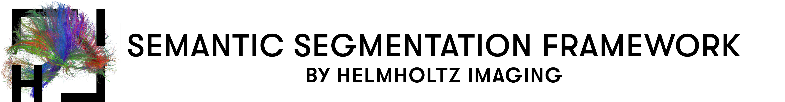

<p align="left">
  
</p>


#Tools

The ``tools/`` folder contains some useful tools for developing and experimenting. 
It is not guaranteed that these tools will work for all kind of use-cases, datasets and datatypes but even then
they can be used as a starting point and can be adapted with a few changes.
These scripts support the general Hydra override syntax as described in [config](../config), together with some additional arguments (these can be used via the argparse syntax with a -- prefix).

### show_data.py
Load and Visualize the pytorch dataset which is defined in the dataset config. Can be used for data inspeciton and to view different data augmentation pipelines.
  - dataset: Name of the dataset config (see [here](#selecting-a-dataset))
  - --augmentation: Which augmentations to use: None (by default), train, val or test. If A.Normalization(std=...,mean=...) is part of the augmentations, this will be undone during visualization to get a better interpretable image
  - --split: which split to use: train, val or test Dataset (train by default)
````shell
pyhton tools/show_data.py dataset=<dataset.name>
pyhton tools/show_data.py dataset=Cityscapes --split=val --augmentation=val
````

### show_prediction.py
Show the predictions of a trained model. Basically has the same syntax 
as the [validation/testing](#run-validationtesting), but visualizes the result instead of calculating 
metrics. The Test Dataset is used for predicting by default together with the train data-augmentations. For a 
nicer appearance the normalization operation is undone during visualization (not for prediction). 
(Note, depending on the size of the input, the inference time of the model and the available hardware, 
there might be a delay when sliding through the images)
  - ckpt_dir: path to the checkpoint which should be used
  - --augmentation: Which augmentations to use: train, val or test (by default). If A.Normalization(std=...,mean=...) is part of the augmentations, this will be undone during visualization to get a better interpretable image
  - --split: which split to use: train, val or test Dataset (train by default)

  ````shell
  python tools/show_prediction.py ckpt_dir=<path>
  python tools/show_prediction.py ckpt_dir=ckpt_dir="/../Semantic_Segmentation/logs/VOC2010_Context/hrnet/baseline_/2022-02-15_13-51-42" --split=test --augmentation=test
  ````

### dataset_stats.py
Getting some basic stats and visualizations about the dataset like: mean and std for each channel, appearances and ratio of classes and potential class weights. 
Also, the color encoding of classes is visualized (can be useful for the show_data or show_prediction scripts)
The output will be saved in *dataset_stats/dataset_name/*. If no output is wanted use the supress_output flag
  - dataset: Name of the dataset config (see [here](#selecting-a-dataset))
  - --name: Prefix for naming the results
  - --split: which split to use: train, val or test
  - --img_only: Flag for only analyse Image Data
  - --mask_only: Flag for only analyse Mask Data
  - --supress_output: Flag to supress creation of an output directory and output files
    ````shell
    python tools/dataset_stats.py dataset=<dataset.name>
    pyhton tools/dataset_stats.py dataset=Cityscapes
    ````

### lr_finder.py 
Implementation to use pytorch lightning's [Learning Rate Finder](https://pytorch-lightning.readthedocs.io/en/1.4.0/advanced/lr_finder.html)
to get some guidance when choosing an optimal initial lr (Should be used with caution, especially if random augmentations are used).
    - --num_training_samples: number of batches which are used from the lr finder (100 by default)
````shell
python tools/lr_finder.py
pyhton tools/lr_finder.py dataset=Cityscapes model=hrnet --num_training=300
````

# Acknowledgements

<p align="left">
   &nbsp;&nbsp;&nbsp;&nbsp;
   
</p>

This Repository is developed and maintained by the Applied Computer Vision Lab (ACVL)
of [Helmholtz Imaging](https://www.helmholtz-imaging.de/).